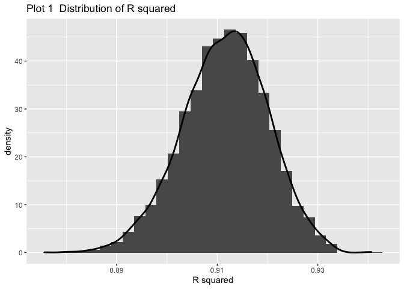
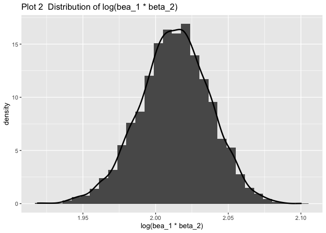

p8105\_hw6\_rq2166
================
Ruoyuan Qian
11/18/2019

``` r
birthweight = 
  read_csv("data/birthweight.csv") %>% 
    janitor::clean_names() %>% 
    mutate(babysex = factor(babysex,level=c(1:2),
                    labels = c("male","female")),
           frace = factor(frace,level=c(1:4,8,9),
                    labels = c("White","Black",
                               "Asian","Puerto Rican",
                               "Other","Unknown")),
           malform = factor(malform,level=c(0:1),
                    labels = c("absent","present")),
           mrace = factor(mrace,level=c(1:4,8),
                    labels = c("White","Black",
                               "Asian","Puerto Rican",
                               "Other")))
```

    ## Parsed with column specification:
    ## cols(
    ##   .default = col_double()
    ## )

    ## See spec(...) for full column specifications.

``` r
list <-which(rowSums(is.na(birthweight)) > 0) 
data_na <- birthweight[list,]
```

# Problem 2

``` r
weather_df =
  rnoaa::meteo_pull_monitors(
    c("USW00094728"),
    var = c("PRCP", "TMIN", "TMAX"),
    date_min = "2017-01-01",
    date_max = "2017-12-31") %>%
  mutate(
    name = recode(id, USW00094728 = "CentralPark_NY"),
    tmin = tmin / 10,
    tmax = tmax / 10) %>%
  select(name, id, everything())
```

    ## Registered S3 method overwritten by 'crul':
    ##   method                 from
    ##   as.character.form_file httr

    ## Registered S3 method overwritten by 'hoardr':
    ##   method           from
    ##   print.cache_info httr

    ## file path:          /Users/ruoyuanqian/Library/Caches/rnoaa/ghcnd/USW00094728.dly

    ## file last updated:  2019-09-26 11:10:51

    ## file min/max dates: 1869-01-01 / 2019-09-30

``` r
weather = 
  weather_df %>% 
  select(tmax,tmin)
```

``` r
#boot_straps = 
#  weather %>% 
#  modelr::bootstrap(n = 1000)

#as_data_frame(boot_straps$strap[[1]])

#a = lm( tmax ~ tmin , data = weather) 
#summary(a)
#tidy = broom::tidy(a)
#b1 * b2
#prod(tidy[[2]])

# r2
#broom::glance(a)[[1]]

estimate = 
  weather %>% 
  modelr::bootstrap(n = 5000) %>% 
  mutate(
    models = map(strap, ~lm( tmax ~ tmin , data = .x) ),
    results = map(models, broom::tidy),
    glance = map(models, broom::glance)) %>% 
  select(-strap, -models) %>% 
  unnest(results,glance) %>% 
  group_by(.id) %>% 
  mutate( log_b = log(prod(estimate))) %>% 
  ungroup(.id) %>% 
  select(r.squared,log_b) %>% 
  unique()
```

    ## Warning: unnest() has a new interface. See ?unnest for details.
    ## Try `df %>% unnest(c(results, glance))`, with `mutate()` if needed

``` r
estimate %>% 
  ggplot(aes(r.squared,..density..))+
 geom_histogram()+
 geom_line(stat = 'Density',size = 1)+
    labs(x = "R squared",
         title = "Plot 1  Distribution of R squared")
```

    ## `stat_bin()` using `bins = 30`. Pick better value with `binwidth`.

<!-- -->

``` r
estimate %>% 
  ggplot(aes(log_b,..density..))+
 geom_histogram()+
 geom_line(stat = 'Density',size = 1)+
    labs(x = "log(bea_1 * beta_2)",
         title = "Plot 2  Distribution of log(bea_1 * beta_2)")
```

    ## `stat_bin()` using `bins = 30`. Pick better value with `binwidth`.

<!-- -->

``` r
n = 
estimate %>% 
  pull(log_b) %>% 
  length()

order(estimate$r.squared)
```

    ##    [1] 2601 3242 4289 2227 1175 2701  417 1102 4495 3907  349 1182  958
    ##   [14] 2144 1234 3620 2796 4032  185 1873 3974 1058 2421 2806 4979  233
    ##   [27]  649  593  788 4779 4637 2305 2926 3214  298 4625 4582 4488 4607
    ##   [40] 1248 4971 4902 1016 3163 4423 1651   66 3727 2657 4871  137 3665
    ##   [53] 4877  275 1414  345 2137 2389 3557 3207 3057 3923  460 3176 4939
    ##   [66] 3443 2350 2540  759 4982 2383  854   21 1253 3564  609  404 3528
    ##   [79] 2419 4944  816 3347  229 4287 4347 3085 1645 1280  319 4099 4691
    ##   [92] 1063 4001  811 2738  242 1572 1674 3447 4014  355 3561  836 3897
    ##  [105] 2666 2892 2882 4649 1111  381  686 3830 1482 4098 3342 1512  988
    ##  [118]  136 2837 2534 1145 1502 2202 1302  603  287  280 3698 2697  406
    ##  [131]  971 1383 2170 4775   98 3385 3563  115 4501 1496 3116 2552  491
    ##  [144] 2989 3520 1991 4202 3494 2838 1080 3157  945  524 2254 4754  264
    ##  [157] 1173 4037 1813  260   79  391 4250 4766 2932 4316 2878 1171 3365
    ##  [170] 1146 4117 4989 3719 1717 3864  189 3215  761 1965 2260 4844  835
    ##  [183] 4451 1395  802 3565 4457 3035 1474 1454 3211 3657 4139 2361  940
    ##  [196] 3521 4843 3416 3529 1754  403 2248 1456 3661 3280 3510 2504 3911
    ##  [209] 2150 2643 4373 3484 1208 2284 4036 2385   11 2982 1999 4033 3685
    ##  [222] 4409 2793 1867  708  529 4901 1488 4509 3944 4940 2485  612 4376
    ##  [235]  588 2484 4467  369  889 1228 4524  312 2853 1791  179 1106 1685
    ##  [248] 1094 1178 2410 3281 2860   83 4038 4567 2582 3560 3855 2820  721
    ##  [261] 2768 2712 4833 4802   48 1331  985 2556 1926 2110 1582 4718 4541
    ##  [274] 3570 2517 4688 2049 4028 1093 1627 3594 4321  257 2316 1037  557
    ##  [287] 2478 4096 2275 4475 3348  328 2035  441 3828 1970  436 2568 2999
    ##  [300] 4572 4226 4892  810 2970 2497 3040 3556 4702 2178 4526 1954 3166
    ##  [313]   88 2182 2380 3397  632 2995  204  801 1122 1288 2079 4053 2016
    ##  [326] 1244 3378 3013 3091 3912 1690 3249 2520  548 1557 1180 1451 2669
    ##  [339] 3608   28  339 3543  560 1424 4977  539 2054 1237 3987 1285 1090
    ##  [352] 3275  130 1652 1201 2948 3222 1951  326 4023 2621 3402 2637 4231
    ##  [365] 4986  520 4389 4482  599 2660 3753  450 2974  348 1713 3973  760
    ##  [378] 2624 3700 1160 2822   73 4242 2151 3273 4405 3159 3373 1088  232
    ##  [391] 4493 3596 3184  121 4686 2781 4089  647 2673  473 2473 4617 4513
    ##  [404]  591 2211 3769 4647 4587 2964 4428 1616 1211 4390  771 4529 4361
    ##  [417] 3711 2855  994 2289  633  432  105 3259 3010 4620 2280 2442 3838
    ##  [430] 2257 1528 3538 1425 1314 4237 1633 1922 3978 1125 3567  463  855
    ##  [443] 3938 3956 2973 4831    2 4191 2123 2197 1919  776 1609 3358 2319
    ##  [456] 2313 2119  266  356 4575 3070 3359 3628 1646  670 3720  713 1307
    ##  [469]  705 4813  478 3287 3903  755 4255 3747 1945 1721  682 1809 3898
    ##  [482] 1127 2578 3901 3759  864 3708 4304 2747 4048 1286 4370 2971 3324
    ##  [495] 2015 3772 2274 1158 4663 2451 2409 3328  212  749 1232 3351 4120
    ##  [508] 2548 1783 3168 1355 3428 2835 1074 3757 4981 2929 1846 4071  852
    ##  [521] 2829 1468 3984 4463 2184 4256 4749 3339   64 4853 3429 3244 1943
    ##  [534] 3740 2487 2065 1374 1819 1129 1060  630 4703 3910 4519 4456   65
    ##  [547] 3437 4152 2080  758 2769 3187 1434 1356 4937 4159 1939 4378 1343
    ##  [560] 1261 1817  505  554 1446 3682 4857  385 3058 1020  667 4109 3953
    ##  [573]  975 2507  474 4829 2231  820  494 3356 3650 4610 2076 3231 1848
    ##  [586] 3450 4739 1081 1753  318 4209 4796  659 2317  862 3105 4027 2105
    ##  [599] 2167 1863 3647 4166  766 1874 3245 3820 2021 1142 2500 2923   32
    ##  [612] 2836 2718  999 3431 1387 3971 3336 3141 4850 1615  475  897 2842
    ##  [625]  881  489 4899  762 4126  183 4319 3178 3477  625 1230 3945  103
    ##  [638] 1188 2884 3301 4823 4480 1899 1137  351 2362 4292 1209 1091 1644
    ##  [651] 1790  380  715 2309 1362 4919 3084  227 4674 3003  209 3381 2245
    ##  [664] 4835 1213 3238  914 2190 2375 1048 1311 1113 1023 4210 1219  120
    ##  [677] 1755 3512 4419 4279 3225   29  397  165 1455  671 2250 2498 1295
    ##  [690] 2418 4520 2538 1740  334 4105 2242 3438  927 3678  545 1338 4962
    ##  [703] 3748  210 4516 3426 3844 4368 1692 2635 1810 1044 3036 1670 3702
    ##  [716] 3894 2482 4153 4807 3162 1241 4366  492 4162 2002 2766 1367 1698
    ##  [729] 3724 4689 3745  416 3733 2628  688 3527 2720  439 2619 2591  422
    ##  [742] 2337 2109 3230  829  222 4015 1050 3591  517 2288 3456 1575 2008
    ##  [755]   18 3119 4597 2038 4728 3997 3179  124 1426 3652  577 1836 1826
    ##  [768] 4311 2684  134  787 4192 2192 1183 1073 3936  827 3082 2193 3549
    ##  [781] 1776 1591  498 2716 3122 2397  459 3489 2005 2944 1890  199 4720
    ##  [794]  795  930  785 4698 3302 1045 3721 1727 2376 2172  519 1981 1429
    ##  [807] 3821 2719 3824 1751 2099  532 3218  808  412 3452 2308 3506  850
    ##  [820] 2224 1629  993  370  430 4425  495 4669   12 1476 3699  487 1885
    ##  [833] 1861 3388 2096 2438   52 4228  200 1553  594 3458 1977 4208 3615
    ##  [846] 3161 4252 2267 4127 1092 1141  536 3030  597 4896 3684 2318 2159
    ##  [859] 3749  203 2717 3635 3592  506 4380 2468 2471 1159  497 1821 2366
    ##  [872] 1626 2073 3913 1535 3949 2063 4414 2690 2183 1216 1929 4630 1124
    ##  [885]   92 3511   42 4052 2567 2432 1207 3648 4445 4460 1038 2816 1748
    ##  [898] 4278 4934 1018 1009  151 4508 1272 3182   91 1417 3164 3043 1737
    ##  [911] 3918 1323 2279 2812 1513 2928 3741 2788 2583 2411 4494  429 1852
    ##  [924] 2883  241  849  961 4966 3597 2223  371 2091  314 4163 4142 3891
    ##  [937] 3576 4068 2310 4193 3219  723 3261 3637 3493 2714 1527 3279 2629
    ##  [950] 4818  744 1192 3391 2572  186 2360 4083 3799 3996   74 1315 2470
    ##  [963]  438 3288 2682 4154 1276 2726 1035 2369  420  970 1614 4927 4967
    ##  [976] 4486  883 2509 3152 4338  984 2967 4185 3177 2357  128 3114 3966
    ##  [989] 4950 2763 3112 3361 4013  616 3074 4144  569 3121  753 1550 3768
    ## [1002] 1490  294 1825 1153   53 4298 1200 3464 4253 1187 1673 3096  343
    ## [1015] 4386 4160 1370 2340 1382 3338 4182 1725 4418 3142  950 4416 4722
    ## [1028]  839 4121 3760 3291 2216 3869 4308 2315 2205  695 2204 1487 4041
    ## [1041] 4248 2852 3524 1509 3833 2966 1324 2246 3188 2391 1039 2006 4295
    ## [1054] 4186 2667 4478  104 4411 2338 1318 2349  650 1098 4265  177 2739
    ## [1067] 1108 2639 2113 4527 2311  243 3858 3983 3148 2914  299 3054 4555
    ## [1080] 4925 1165 3360 4124 4611 4548 4954 4957 3902 3186  600 4580 1689
    ## [1093] 4349   49 2588 4430  822 3208 1818 1560   76 1270 4893 3654 1431
    ## [1106] 3337 4920 2373 2072 1240 4254 4834 2648 1750  987 2261 3663 4111
    ## [1119] 4244  147 2388  979 1763 1444 3816 4758  997  841 1190 2972 4709
    ## [1132] 3810 3344 2889 1172 4531 3044 3390 3811  716  335 3286 4708  938
    ## [1145] 1284 2368  694 1837 3183 1363 2743 3131 1462 2558  146 3992 1662
    ## [1158] 1151 2794 1759  329 2393 3710  448 3444 1851 4692 3055  792  917
    ## [1171] 3681  352 4400 2296 3847 1536 4514 4705 3588 1797 4569 3087 3507
    ## [1184] 4045  789 2466  947  346  629  909 4291 3716   37 2862 3701  698
    ## [1197]  565 1924 4367  480 4533 1002   36  638 3915 2447 4565 2632 4461
    ## [1210] 3610 2121 1339  814 1053 4898 1802 3206 1543 1659 3616 1925 4303
    ## [1223] 3725  297 4591 3174 3053 3579 1296  231 4357 4190 1656 1559 1064
    ## [1236] 2343 3559  956 3640  990 3497 3948 4980 2458 1494 3078 2954   84
    ## [1249] 2218   93 1156 2058 4268 2459 4238 1246  912  112 3079  901 4066
    ## [1262] 4935 3239  856 1357  730 3583  488 3457 3307 1290  834 3169 1028
    ## [1275] 4522  187 3554  826 2910 3295  607 1252 2188 2212 2808 2879 4502
    ## [1288] 4449  848 1581 2047 2897 1344 4438 1683 4936 4194 2439 1774 1666
    ## [1301] 3969 3970 1937  375 4350 3531 2653 3034  164 1962 1467 2533 4443
    ## [1314] 2302    3 3964  558 4123  534 4827 2264 2269 3278  823 1070 3542
    ## [1327] 1238  572  751 4326 1875 1138 3673 1330 1953 4371  910 4471 3950
    ## [1340]  790 1086 4592 3921 3919 4694 2052 1396 3899 1578 3128 1908 4666
    ## [1353]  172  880  911 4130 2612 3315 2134  530 2095 1452 2626 1574 3730
    ## [1366] 1711 2839  465  628 1403 1133 2692  361  578 1647  447 2805 1793
    ## [1379]  699 1850 2398 4010 4757 4011 2332 3220 2033  458 4762 1054 3099
    ## [1392] 1976 4054 2776 4026 3271   40 4583 1839 4174 2347 1632 3310 3018
    ## [1405]  523 3780 2528 2730 2675  953 2051  754 3260 4387 1169 1493  332
    ## [1418] 3795 2381 1745  353 4842  747 1359 3666 4024  541 1402 2462 2875
    ## [1431] 1032 4091 1762 4822 2108 3468 4640 2858 2931 2559 4554 1639 1947
    ## [1444] 2911 4552  424 4804 3419 4269 2891  283 3537 4584 4204 2165 2345
    ## [1457] 4016  706 2003  710 2513 1637 2139 3434 1303 1361 1291  725  936
    ## [1470] 2320 2887  338 2327 3998 2830 2797 3696  844 3303 4848  786 1465
    ## [1483] 4778  683 4700 4972  973 3889 1022 2372 4959 2671 2154 1118 2392
    ## [1496] 1052 1342 2299  516 4737 1347 2764 4537 3387 3146 3621 4101 3509
    ## [1509] 4440 3743 4733   57  537 2658 4078 2281 4145  213 1618  304 1189
    ## [1522] 4074 1709 4678 1001 4119 2698 2745  116   82 1423 2437 3586 1956
    ## [1535] 4518 2042 2423 3297 2012 1667 3145  251 3783 3937 1585 3806 4740
    ## [1548] 2129 2754 4224 2135 4952 2844 3765 3366 2461 1941 2148 3093 1218
    ## [1561] 2676 2555 1525 1785 4195 1139 4825 3072  259 3143 3316 3256 4039
    ## [1574] 1693  340 1206 4169 4638 3835 4789  846 1392 2542 4951 4329  316
    ## [1587] 2427  701 2071  884 3750 3865 4274 1679  508 2728 4005   85  913
    ## [1600] 1436 4795 3371 2420  845 1340 4459 3453  278 3248 2088  635 2463
    ## [1613] 1619 4750 4578  777 4128 4662 4181 3075  357   24 4324 2778 3960
    ## [1626] 1510 2127 2523 4282 2777 2729 4342 2353 3925  383 4797 2901 2600
    ## [1639] 1778 2472 1605 3871 1025 2650 1271  228 4791 2553 4932  522  144
    ## [1652] 2663 2306 3486 1630 3764  443  159 1471 4759  247  903 4382 3778
    ## [1665] 4156  161 2424 4271 2945 3357 4179 2681  831 2026 1163 1015  118
    ## [1678]  791 2798 4882  861 1116 4615 3210 1972 1511  965  258 1880 4515
    ## [1691] 1828 1007 1681  149 2767 4593 3927 2849 4059 3614 3893  640   41
    ## [1704] 3841 2688 4260 3300 3418 2896 2704 2024 1735 1603  324  614  982
    ## [1717]  292 3037  669 3962 1971 1121 2545 2217 3321 4218  196 4811 1282
    ## [1730] 1210 4730  286  384 4247 1083  255 3473  419  110 4773 2947  805
    ## [1743] 2825 2873 3413 2659 1766 3241 2631 1466 3618  745 3420 2307 1409
    ## [1756] 1864 2371  360   10 2934 2057 4417  763 2522  875  664  712 2355
    ## [1769] 3103 2941 2175 1084 3646 3683 1164 2709 2700 1520 4701 2162 1184
    ## [1782] 2539 2765 2481 4103 4082  952 3669  392 1231 3572 1983 3825 3515
    ## [1795]   59 2525 1498  824   34 3680  408 3842  435 3422 3064 4365 3581
    ## [1808] 1310 3590 1532  563 3481 4245 4839 2630 4830 2565 3492   86  366
    ## [1821] 4102 2613 1739   96 2953  306 1278 3088 4571 2301 4503 2876 4801
    ## [1834] 1938  440 4887 3846 4348  680 4087 3192 2493 4446 4065  799   94
    ## [1847]  531 2803  295 2711  797  905 2270 3627 3482 3027 1906 3466 2940
    ## [1860] 3009 1736 3976 3732  542  896 1568 1786 1152 4907  977 4693 3430
    ## [1873] 3355  173  483  893  932 4697 2117 1747 1684 3728 1773 1620 3474
    ## [1886] 4225 1665 2737 3774 2783  690  302  571 3292  780  236 1695 1780
    ## [1899] 2341 1013 1061 4261 3100 4401 4755  665 1479  238 4568 1143 3118
    ## [1912]  296 1256 1274 4317 2937  764 3136 4473 3849  727  700 4137 1057
    ## [1925] 2048  773  803 1538 1305 3368 1964 1508 4546 1333  641 3341 1101
    ## [1938]  832  402 2514 1135 2387 1126 4798 4187 2133 3922 4441 4484  637
    ## [1951] 2661  254  320 3345  741 2956 3951 1631  925  512 1769 4714 1877
    ## [1964] 1350 3202 3803 3959 2258  604  825 3957  393  618 1041 3117 4450
    ## [1977] 2171 4917 4931 1903 4713  654 1563 3132 1221 4723 2863 2749 1731
    ## [1990] 4777 2593 3797 4491 3363 1393  746 1191 4184 4765 2237 3981  949
    ## [2003] 1896 3690   90  606 3532 4251  693 2877 3147 4286  737 4941 4856
    ## [2016] 4812 3270 4049 1369  350  819 1358 4474 3876 4738 3863 1997 3069
    ## [2029] 3906 3377 4673 3942 2590 1942  285 2230  673  132  333 4547 1320
    ## [2042] 1071 4543 4761 3362 2377 2526  935 2959  456 4746 3584 4860  399
    ## [2055] 1712 3195 2804 2787 2492  201 1385 1472 3786 3032 4784 3421 4266
    ## [2068] 4236 3890 1378 1708 2508 4521 3235 3380  676 1131 2149 1226 3021
    ## [2081]  515  471 4923 4794 3930 2725 1918 1907 2017 2405 1413 1891 1204
    ## [2094] 4865 4277 4628 1245 1841 1936  922 3092 2532 3505  585 3471 4407
    ## [2107] 4497  923 3826 3216 1994  736 1594 2443 1177 3189 2801  192  244
    ## [2120] 4487 2103 2140 2090 4219 2537 1946 2752  873 4969 3376 2841   14
    ## [2133] 2358 2018 3868 3513 2627 2574 3566 3022 4908 2138  133  129 3448
    ## [2146] 3601  646 1928 1812  769 1440 4334 2259 3671    1 1957  937 1694
    ## [2159] 4790 3577 2263 2740 4314 3198 3688 1453 2025 2082 2975 4864  954
    ## [2172] 1399 1289  933 2519 2124 3393   56 4284 2085 2050 2898 2251 1104
    ## [2185] 1663 3963 3717  330 4645 1386 4149 2713  521 1269 2750 2991 2541
    ## [2198]   55   67  368 4763 3383 1960  310 3928 2505 1814 2440 4799 3284
    ## [2211] 2895 4852 2869  282 3651 2075 2107 2290 2790 4076 4840 4429 4447
    ## [2224] 1469  365 4022 2363 1540 2098 4472 4528 2201 3227 3659  887 4147
    ## [2237] 2965 2491  566 3793 1518 4415 4431 2066 4517 3414 4631  414 3625
    ## [2250] 2949 1742 1089 1829  962 1198  642 4680 4158 3469 1686 2111  550
    ## [2263] 1332 1592 2645  176 3406 4654  718 4949 3516 2563 2131 2062 2585
    ## [2276] 4146 2622 4136 1844 2412 1484  998 1217 4259   15 3062 1529 4112
    ## [2289] 4402 1767 4352 3788 3677  742 4433 2187 1437  290 2723 3961 2365
    ## [2302] 1255 2206 3025 4343 1822  891 3379 4110 2772 4561  796  470  734
    ## [2315]  504 3006  821  411  740  830 4420 1758 3496 2094    7  141 3203
    ## [2328] 2571 4092 3600 1580 1486 3916  779 3920  809 1593 2031 2707  180
    ## [2341]  208  469 3028  464 3061 3412 3612 3334 4760  395 4427 3024  551
    ## [2354] 4322 2530 4577 3812 3562 3519 1923 1329  546 4600  748 1416 3309
    ## [2367]  421 4477 4558 4665 2249 2569  729 2425 1699  570 4946 1299 2464
    ## [2380] 4861 1764 4805 1567   25 3305 1458 1033 2736 2198 3622  549 4933
    ## [2393]  714 4743 4131 1297  446 2921 2503  452 4006 2022 1718 1827 1114
    ## [2406] 4841  188 2352 3123 4619 4768   81 3045 1112 4881 1658 4653 3994
    ## [2419] 1376 3095  750 4961 2674  457 3185 3599  265  876 1010 4975 2602
    ## [2432]  867 2010 4659 2479 1485  377  733 3866 2454 1371 3839 3611 2900
    ## [2445]  482 3694 4767 3323 2850 2554 2495 4742 2795 4627 4904 3041 3113
    ## [2458] 1677 3980 4676 3914  145 3049 3212 3005 4095 2453  270 2272 1832
    ## [2471] 4004 2511 4792 1993 2125  153  774  636 4928 3209 1136 4672 3568
    ## [2484] 3818 3293 2007 3623 4104 4888  268 2560 2925  596  321 4780 3533
    ## [2497] 1872 3407   89  679 4921 1275 1427 2069 1643 2757 3499 4075  674
    ## [2510] 2652 2594 4293 3989 1883 4667  648 4479 2516 2577 1934 4106 3386
    ## [2523] 2907  661 3409 3634 2867 1214 2146 2329 2881  109 3558 1503 1784
    ## [2536]  833 4710  152 2770 4968 1641 4216 2751  388 1602  857  765 1123
    ## [2549] 1017 3534 1085  888  587 3718 3033 2617  858 1654 1798 1179 3872
    ## [2562] 1072  311  364 2326   19 4616 4088 2543 1904 3794 4000 2431 4372
    ## [2575] 1294 1992 2450 4167 3814 2695 1264 2976 4752 1704  367   78 1672
    ## [2588]  378  863 2918 3762 1807 3555  405  181 4412   68 4505 4206 2512
    ## [2601] 1968 4590 4215 3251 4230 2335 4873 4276   69 2168 3687 1457 3958
    ## [2614] 2633 4499 3656 1432 4406 4911 2374 2502  500 4122 1404 1011 3276
    ## [2627]  454  293 1771 2189 1801 2640 3392 4880  915 3954  605 4221 3692
    ## [2640]  584 4060 2791 2029 3326 4916 1224 1352  955 3754 1705 2748 2255
    ## [2653] 2831 3485 1636 1843 4462 3258 4958 4351  691 3173 1806 4051  583
    ## [2666] 1608 2271 1500 2634 4748 1910 4729 4699 1624 4285 1935 3706 4744
    ## [2679]  711 2845 1516 4301 1804 1564 2239  739  358 1738  413   72 4178
    ## [2692] 4838 1132 2646 2880 4064 1628 2984  169  538 3133 4538 1571 2915
    ## [2705]  511 1056 1117 3525  980 1008 2611 2753 2859  652 2924  743 1635
    ## [2718] 3792 1373 2616 3526  644 1442 3729 2166 1461  944 3551 3205 1203
    ## [2731] 3094 4581 1831 4960 3518  256 4570  507 4891 4464 3140  847 4643
    ## [2744] 4557 2089 4375 4452 4203 2207 4549 3713 4753  768 3968 1854  983
    ## [2757] 2903 2179 1055 4507 4594  752 1570 2023 4116 2370 3929 3946 3649
    ## [2770] 3843 3204 4598 3501 4545 1140 3314 1046 1606 4588 1047 3317 2564
    ## [2783]  575  423 1065  886 4721 4207 4132  162 2097 4633  291 3311  963
    ## [2796] 1095  656 3952 1668 4978 3777 2870  561 3632 4344 2840 3451 1612
    ## [2809]  166 3630  717 3580   16 1229 1279 2234 4914 4574 4734 4895 2741
    ## [2822] 1558 3108 3415 1838 2364 1634 1787 4046 4021 1401 2268 1893  617
    ## [2835]  564 3107 4586 2208 3236 1470   95 3488 2339 3582 2917  622 4243
    ## [2848] 3109  323 2219 1588  281 4385 4576 4273 4151 2236 2981   99  842
    ## [2861] 4155    6 4331 2815 4241 4622 1682 2638 2253  493 3679 2229  485
    ## [2874]  148 1205 1589 4900  167 4942 4995 1949 4889 1222 1251 3267 4340
    ## [2887] 1242 1030 2549 1988 4725 1348 1533   45  894 2693 1317  871 3832
    ## [2900] 3734 4369  878 1300 1765 2494 4603 4305 3151 4275 1304 2696 2668
    ## [2913] 1364 1710 4585 1326 4869 2266  245 3265 1940 3318  619 2773 3726
    ## [2926] 1097 1087 2775  552 2252 1958 2325 1024 3932 4345 3023 1014 2618
    ## [2939] 4670 1948  882 4363 3917 2401  434 1287 2014 3993 3813 2106  921
    ## [2952] 2702  966 2706 1445   35  221 2828  900  433 4067 4258   39 3787
    ## [2965] 4926 1902 1043 1519 4990 1604 4358 1375 4468 1613 4115  559 4756
    ## [2978] 1107 4272 1869 3400 4732 3644 1266 3398  218 3129 4500 1103 3455
    ## [2991] 1247 1932 3607 4875 4079 2426 3603  514 3539 4726 4817 3257 2746
    ## [3004] 4735 4148  342 1530 1595 2990 4998 3127 2163  574 4711 1696 4492
    ## [3017] 4300  813 2225 3071  843  904 2894 4595 3707  263  672   17 4339
    ## [3030]  663 3664 1443  732 3375 3585   50 3200 4262 1003 3859 2888 3985
    ## [3043] 3755 1262 3675 4849 1418  195 3689 2287 3705 3250 3693 1004 2573
    ## [3056] 2441 4997 3831 3530 4974 3004 4863 3796  989 2993  807 1661  119
    ## [3069] 3823 2677 3417 2807 3934  138 1181 1328 4769  272 3977 4100 4118
    ## [3082] 1622 1504  400  157 2935  206 4884 4867 1989 2579 1059 1805 1998
    ## [3095] 1325 4436 2857 3172 3490 2475 1697 4905  253 2872 2157  171 2404
    ## [3108] 3815 4235  794 1660  499 1249 2997 1523  309  902 1334 3975 4410
    ## [3121] 2295 4294 3602 2064 2885 2199 2527 4108 4044 3330 2164 4535 1884
    ## [3134]  477 3606 1898  926 3658  992  724 2969 1969 2384 4657 2416 3156
    ## [3147] 4510 3073 4897 2044 2346 4381  942 2142 2413 4523 3102 2785   60
    ## [3160]   97 3369 1756 4605 2395  611 4890 4604  964  466  501 3500  197
    ## [3173] 2784 2654 4020 4695 2686 2185 1601 3039 3343 1868  382  767 2501
    ## [3186] 2596  315 1149 2871 3775 1322 1680  117 3217 3822 2256 3228 2909
    ## [3199] 3758 3042 1155 2623 4140 4188 3883  484  613 3213 1537 4970  598
    ## [3212] 3237 1961 2004 3232 1079 4062 4392 4626 3852 4200 4948 2114 2544
    ## [3225] 1966 4080    8 3990 1259 3624 2312 4828 1196 2100  407 4097 1916
    ## [3238] 1551 1853 3255 3442 3274 4679 2987 2428 4229 3138 4383 1824 1979
    ## [3251] 3517 3629  526 3399 2155 1360  250 4532 3020 3995 1703 1186 1492
    ## [3264] 2152 1115  305 4391 2020 3908  556  363 2962  573 1077 1770  102
    ## [3277]  108 2402 4781 1394  194 1049 2444 4991 2762 4866 2913 4943 2083
    ## [3290]  868 3394 4453 4448 2614  211 1026 2642  215 3150 3199 2983 1900
    ## [3303] 1546 1497 3955  968 3785 2536 4644  653 3480 3340 4134 1312 4217
    ## [3316] 4635 3374 4296 1600 2866 4832 2708 4511 2013 2496 2756 3124  735
    ## [3329]  783 4214 2780   20 3767 4845 1669 2262 2833 4421 3939 4601 2101
    ## [3342] 4280  425 3002  941  722 2524 3722 1561 1859 1728 3106  924 3026
    ## [3355] 1598  288 3804  800 3851 4973 2476  547 2001 1855 4379 3243 3048
    ## [3368] 4047  226 2651 1544 2586  906 2417 1905  948 3522 1856 4868 2480
    ## [3381]  687 1931 2760 2890 3008 2810 3014 2403 2359 3272 4197 1161 4170
    ## [3394] 1777 1607 4992 1933 1505 3479 3333 1389 3120 4175 3081 1808  486
    ## [3407] 4424 2731 3165 3396 3965 3191 2328 1308 3544 2799  107 3854 2232
    ## [3420] 2055 4512 2477 3083 1548 4090 1611  866 2802  427 3282 3972 1029
    ## [3433] 1273 1150 1260 2963 4150 4556 3829 4434  704   61 2445 1522  267
    ## [3446]  303 4983 1741 1746 2303 1174 1524 4883 2985 1796 1478 2214 3605
    ## [3459] 3139 3545 3395 1157 3947 2980 3552 1068 1154 1623 3264 3367   71
    ## [3472] 2282 4180 3736 2998 1541 1400 1847 1435 1433 3149 4422  772 3709
    ## [3485]   13   26 4085 3776 2727 4003  620 2467 4539  645 3578 1422 2952
    ## [3498] 1239 3223 1398 2240 1799 2506 1576 2551 4481  461 3613 4624  262
    ## [3511] 2043 2724 2960 3840 1815 3756 2265 1345 1833 3016 2843 4057 4017
    ## [3524] 3766   27 1545 1963 1316 1820 2905 3850 3817 2789 2546  651 4395
    ## [3537] 2689  928 3126 3229 2800 2606 3878  627 3353 2483 4498 1215 1227
    ## [3550] 3770  449  415 1372 1913 3329 3495  453 3266 2153 4682 4360 1377
    ## [3563] 1225  976 4341 2386 4173 2735 1327 4745 2084 4553 2194 2070 3052
    ## [3576] 1772 3325 4993 2331   51 1421 2641 1491 1959 3405  114 2378  513
    ## [3589]   33 3167  731 2028 2939 2955 4135 4377 3641 3595 4675   46  301
    ## [3602] 2278 2074 1849  476 4205 2122 3066 3991 3285 3277  230 1887 4034
    ## [3615] 4786 2456 1722 2209 3144 1194 1257 1768 1987 4808 1723 3773 4504
    ## [3628] 4063  269  877 2761 2136 3674   58 2067 3313 4138 2978 3735 2561
    ## [3641] 4646 3047 3546 2390 4211 3642 1978 2679 3181 3870 3882 3308 1475
    ## [3654] 2647 1197  959 2916 4690 2400 2566 2811 1888 4559 1649 1586  354
    ## [3667] 4355 1335 2036 1481  468  331  778 4618 2930  815  442 3508 3704
    ## [3680]  289 2958  660   77 4328  869 3433 4534    5 1995 4564 2868 2215
    ## [3693]  139 2927 4906 1170  592 4859 4965  602 2694 4435  675 3827 2195
    ## [3706] 3460  193 4837 4469 4470 1235  996  155 1871 2053 3410 4964 3483
    ## [3719] 1267  553 4764 3789 2087 4886 1579 3805  899 1990 2314 3160 3304
    ## [3732] 3862 2041 4290 4809 3737 1341  544 4988 2865 3441  123 1857 1119
    ## [3745] 3548 2030   47 1507 2078 1144 3892 2330 2344 1909  689 4454  225
    ## [3758] 1642 3885  643 4093 4107 2919 3408 2304  907 2823  223 3619 2241
    ## [3771] 1096 4560 1062  307 3836 4393 3038 2011 1298 2655 3067 3672  851
    ## [3784]  284  170 2996 4909 3819 2169 3175 2243 3007 1321 2732 3751  240
    ## [3797]  697 1411 3015  431 1521  991 2854 3294 3695 3125 4143 2518 4496
    ## [3810] 2598 4652 2575 3986 4684 1889  143 1975  246 3639 1687 4800 4332
    ## [3823] 2322  986  479 1858 2786 2415 3761 3598 1428 4086 1082 2625 1996
    ## [3836] 4125  728 3573 4996  920  401 1648 1265 4770  190 2595  373 4485
    ## [3849] 1243 3424 4335 1042 4629 2846 3427 1816  300 3569   54 3514 2297
    ## [3862] 2334 1583 2414 2336 2291 4870 1193 1974 3170 1517 1380 4288  623
    ## [3875] 4712  608 4030 2672 1368 2238 2733   70 3541 4320 4084 2499 3550
    ## [3888] 2019  207 1167  249  865  387 3171 1075 1306 4336  337 2685 2734
    ## [3901] 1775  929 2610 3320 1882 2988 3089 4648  995 2758 3331 1691 3636
    ## [3914] 3895  818 1749 2160 4069   31 1506 3158 2615 1621   80 1894 4040
    ## [3927] 2068 3472 1292 4727 3240  872 4929 1878 2946  655 1148 2298  703
    ## [3940] 2147 3051  828 2782 1477 4606 4177 3476  503 1892  336  919 1555
    ## [3953]  874 3197 1912 2465 4707 3077 4614 1365 3134 1617 4081 2961  806
    ## [3966] 3504 3575  582 4639  410 1223 1459 2283 1448 1309  274 4826  390
    ## [3979] 2580 4353 4018  838 1185  178 1917 1596 4525 4741 1795 2448 1254
    ## [3992] 4736 1351 4551  885 2294  528 2656 2774 3254 2379 2957 1438 3731
    ## [4005] 2620 1021 1870 2902 2607 4930 3296 4025 2664  639  658 1480 2145
    ## [4018] 4717 5000 3933 2680 3631 4806 3798 1599 4894 3540 3097 2027 4114
    ## [4031] 2032 3346 3115 2562 1405 2429 4426  277  908 4671  784 2446 3470
    ## [4044] 3233 4399 4955 4442 1565 2670 3068 2922 3979  467 4012 4007 2460
    ## [4057] 3193 1147  191 3638  341  327 1911 2792 2422 1040 3848 2899 3130
    ## [4070] 1105 3439 2576  518 1729 4263  234 2848 1195  525 3268 2191 1388
    ## [4083] 3475 3723 3247 4878 4397  252  158 2938 1381 4483  567 2535 1012
    ## [4096] 3667 4681   87 4213  626 3676 3491 2213 3029 2116 3574 3090 4719
    ## [4109] 4234 1031  692 3467 4310 3779 3423  239 2597 2455  580 1760 4307
    ## [4122] 3246 3252 3738  389  879 1701 1876 2979 3617 2819 2273 1921 4987
    ## [4135] 4413 3465  175 3967 4035 2430 1489  184 1830 2968 1779 4655 3643
    ## [4148] 3941 3553 1301 2324 4239 2814 2126  837 1539 4133 2132  719 1973
    ## [4161] 3670 3498 4404  437 4094 4947 1944  870 4176 4318   38 2687 4061
    ## [4174] 2826  960 4364  386 4656 3104  154  981  224 4783 4222 1789 4793
    ## [4187]  677 1473  934 1675 2128 2130 4912 4621  770 3306 1464 2156 1734
    ## [4200] 3763  462 2705 1638 3633 3196 1281 3904 3691 1800 4172 1130  527
    ## [4213] 3289 4168 2292 2636 3853 1199 2059 3771  219 3712 3001 2691 1501
    ## [4226] 2196 4476 3845 2222 2992 3059   22 1655 2180 1366 2045 1542 4544
    ## [4239]  590 3926 4847 3263 1220 3589 1702  111 3931 4506 4019 4642 1233
    ## [4252]  853 4157 3101 4281  535 2861 1336 2093 3784 2221  455 4031 1419
    ## [4265] 2286 3011 2608   43  205 4055 1391 4820 2060 2943 1752 4466 4608
    ## [4278] 1277 3935 2034 2228 4660 1069  198 1986  214 2886 3503 1415 1792
    ## [4291]  160 1499 1410 2587 1920 2920 1319 1263 1556 4536 1212 1019  898
    ## [4304]  322  398  969 4985 2834 4836 1495 2570 1534 1881 2342 3715 1950
    ## [4317] 3536 1128 1914  394 2102  793  220 2906 1027  540   75  972 2771
    ## [4330]  696  509  812  890 1597 2644 4862 4403 2584  472 4704 1420 3535
    ## [4343] 4661 3478 3154 4330 4612 4623 1346 4129  150 1952 1650 2277 2904
    ## [4356] 1587  313 3332 3808 1733  957 4858 4731 1901 4220 1700 3802 4384
    ## [4369]  840 3861 1842 4315 4306 1168 4876 3445 2200  709 4815 4785   30
    ## [4382] 4359 3221 1283 4050 1006 4976 3909 3425  127 1441 2557 1531  610
    ## [4395] 3686  125  490 4953 4810 4346 3449   44 1573 3226 1678 3462 3877
    ## [4408] 4043 1526 3461  481 4327 3645 1450 2605 4455 2649 4874 4398  374
    ## [4421] 2333  621 4632 2486 4922 3502 2323 4716 3791 4008 4984  978 3056
    ## [4434] 4724  140 3982 4201 4821 2367  276 2176 3180 4227 3487 1110  409
    ## [4447] 3137 3050 3224 3349 2449 2235 3404 1547 2986 3335 1076 2603 2046
    ## [4460]  757 3290 1716 1726 4696 3153  451  372 2276 3435 2531 3283 2226
    ## [4473]  379 4589 2599 1100  931  317 3884 2779 1610 2081  631 3000 2851
    ## [4486] 1845  533  248 4956 3322 3801 3746  325 3886 1803 4683 4658 4249
    ## [4499] 2547  359 4394 2174 4706 4141 2177 2678 4816 4641  967 3098 2813
    ## [4512] 2452 4530 1120 1895 1067 1788 4223 4566 1982 2744 1862 2112 4432
    ## [4525] 1353 3593 4685 2722 1236 2247 1823 1099 2515 1834 4165  562 1811
    ## [4538] 2061  496 4751 1412 4851  895 2056  916 1134 4198 2293 1349  543
    ## [4551] 4924 4963 2039 3896 2977 2181  279 1835  444 1640 4651  946 2874
    ## [4564] 2000 4189  396 3440 2436 4183 2759 4323 3352 2407 3860 1706 4056
    ## [4577] 2356 3668 3943 1757 2490  113 1407 4212 2755 1439 3446 1625 1250
    ## [4590] 3401 4573 2474  775 2592 3411 2710 4171  804  662  678 4664 1732
    ## [4603]  738 3319 3834  798 4634 1354 4070 1984 4257 2715  362 1036 2665
    ## [4616] 2037 2856 1463 4240 3742 4668 3703 3587 2521 3382 3463 4814 2742
    ## [4629] 2683 1408 4439 1337 2321  135  101 1664  634 4636 4999  237 4009
    ## [4642]  163 1202 4302 2489 2827  707 2893 2912 3312 3626 2143 1927 2864
    ## [4655] 2699 4444  624 2173 1051 3999 2933 4196 4233 3874 2662 4771  174
    ## [4668] 2435 3019 1549 3327 4297 1313 4164 2186 4918 4788 1671 4388 1554
    ## [4681] 4309  918 1515 4396  720 1397 3881 4747 3350 3372 3697 3135 3660
    ## [4694] 3873    9 1000 4312 1166 2908  939 3809 3262  586 1688 3653 4199
    ## [4707] 1707 2950  217 1657 2488 3076 2581 3662 3604  156 1447 4550 2847
    ## [4720] 3782 4354 3155  418  168 4596  142 1552  568 2529 3454 1430 4774
    ## [4733] 3781 4002 2086 2158 1569 2510 1743 1840 1109 1781  122 3879  668
    ## [4746] 1860  308 4437  126  951  106 1584  216  581 3856 1980 2092 4579
    ## [4759] 4161 1078 3875 3655 2354  271 4299 4782 2951  666 4058 2406 2141
    ## [4772] 1268 1955 2434 3012 4408  859 2210 4325   63  601 4846  589 1590
    ## [4785] 2832 3194 3060 3609 4232 4609 1985 2396  860 3714 4246 4374 1577
    ## [4798] 2936 4855 4903 2203 3905 2817 3887 3046 4854 1034 2244  576  685
    ## [4811] 4772 1761  428  131 4356 3459 1930  657 3523 3940 1744 4270  445
    ## [4824] 2433 3354 2818  702  781 2161 3547 1258  344  376 4879 3063 4677
    ## [4837]    4 3403  892 2104 1066 3190 4650  502 4599 2609 2220   23 4077
    ## [4850] 1390 1897  756 3031 4819 3880 3201 4029 3807 1176 4803 3800 2809
    ## [4863] 1967 1676 4073 2300 1384  261 4072  510 4787 3389 1514 3790 2285
    ## [4876]  684 3080  726 2115 2824 2233 4337 3086 2382 2821 4542 4602  943
    ## [4889] 2394 2457 3298 2589 4362 3370 3900 4563  974 1794 4885 1293 1886
    ## [4902] 4824 1162 3988 1449 1865 4283 2550 1460 1005 4490 3924 4562 4687
    ## [4915] 2348 3065 2399  182  782  615 1782 1719 4540 1715 4458 2120 4042
    ## [4928] 4489 2469 2040  347 1879  426 1720 3744 3299 3432 1730 3269 1379
    ## [4941] 3752 4613 1653 2351 4910 3017 4776 4945 4264 4913  579 2077 4333
    ## [4954]  100 2942 1724 4872 1915 2118  595 2408 3234 2009 3111 3384 3110
    ## [4967] 4994  681 1714 2703  555 1562 1483 4465 1866 3253 4267 3888  273
    ## [4980] 3571 4113  235  202 3436 3867 3739 2994 1406 3364   62  817 4313
    ## [4993] 2604 3837 4715 4938 4915 2721 1566 3857

``` r
ci = 
estimate %>% 
  mutate(r.squared = sort(r.squared),
         ci_95_r_squared = 
           str_c(round(r.squared[0.025*n],2),
                 "-",round(r.squared[0.975*n],2)),
         log_b = sort(log_b),
         ci_95_log_b =
           str_c(round(log_b[0.025*n],2),
                 "-",
                 round(log_b[0.975*n],2))) %>% 
  select(-r.squared,-log_b) %>% 
    unique()

ci
```

    ## # A tibble: 1 x 2
    ##   ci_95_r_squared ci_95_log_b
    ##   <chr>           <chr>      
    ## 1 0.89-0.93       1.96-2.06
