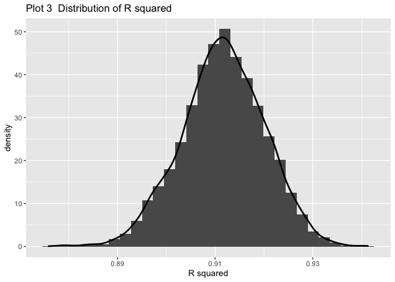

p8105\_hw6\_rq2166
================
Ruoyuan Qian
11/18/2019

# Problem 1

Tidy data

``` r
birthweight = 
  read_csv("data/birthweight.csv") %>% 
    janitor::clean_names() %>% 
    mutate(babysex = factor(babysex,level=c(1:2),
                    labels = c("male","female")),
           frace = factor(frace,level=c(1:4,8,9),
                    labels = c("White","Black",
                               "Asian","Puerto Rican",
                               "Other","Unknown")),
           malform = factor(malform,level=c(0:1),
                    labels = c("absent","present")),
           mrace = factor(mrace,level=c(1:4,8),
                    labels = c("White","Black",
                               "Asian","Puerto Rican",
                               "Other")))
```

    ## Parsed with column specification:
    ## cols(
    ##   .default = col_double()
    ## )

    ## See spec(...) for full column specifications.

``` r
anyNA(birthweight)
```

    ## [1] FALSE

``` r
 fit = lm(bwt~.,birthweight)
summary(fit)
```

    ## 
    ## Call:
    ## lm(formula = bwt ~ ., data = birthweight)
    ## 
    ## Residuals:
    ##      Min       1Q   Median       3Q      Max 
    ## -1097.68  -184.86    -3.33   173.09  2344.15 
    ## 
    ## Coefficients: (3 not defined because of singularities)
    ##                     Estimate Std. Error t value Pr(>|t|)    
    ## (Intercept)       -6265.3914   660.4011  -9.487  < 2e-16 ***
    ## babysexfemale        28.7073     8.4652   3.391 0.000702 ***
    ## bhead               130.7781     3.4523  37.881  < 2e-16 ***
    ## blength              74.9536     2.0217  37.075  < 2e-16 ***
    ## delwt                 4.1007     0.3948  10.386  < 2e-16 ***
    ## fincome               0.2898     0.1795   1.614 0.106551    
    ## fraceBlack           14.3313    46.1501   0.311 0.756168    
    ## fraceAsian           21.2361    69.2960   0.306 0.759273    
    ## fracePuerto Rican   -46.9962    44.6782  -1.052 0.292912    
    ## fraceOther            4.2969    74.0741   0.058 0.953745    
    ## gaweeks              11.5494     1.4654   7.882 4.06e-15 ***
    ## malformpresent        9.7650    70.6259   0.138 0.890039    
    ## menarche             -3.5508     2.8951  -1.226 0.220083    
    ## mheight               9.7874    10.3116   0.949 0.342588    
    ## momage                0.7593     1.2221   0.621 0.534418    
    ## mraceBlack         -151.4354    46.0453  -3.289 0.001014 ** 
    ## mraceAsian          -91.3866    71.9190  -1.271 0.203908    
    ## mracePuerto Rican   -56.4787    45.1369  -1.251 0.210901    
    ## parity               95.5411    40.4793   2.360 0.018307 *  
    ## pnumlbw                   NA         NA      NA       NA    
    ## pnumsga                   NA         NA      NA       NA    
    ## ppbmi                 4.3538    14.8913   0.292 0.770017    
    ## ppwt                 -3.4716     2.6121  -1.329 0.183913    
    ## smoken               -4.8544     0.5871  -8.269  < 2e-16 ***
    ## wtgain                    NA         NA      NA       NA    
    ## ---
    ## Signif. codes:  0 '***' 0.001 '**' 0.01 '*' 0.05 '.' 0.1 ' ' 1
    ## 
    ## Residual standard error: 272.5 on 4320 degrees of freedom
    ## Multiple R-squared:  0.7183, Adjusted R-squared:  0.717 
    ## F-statistic: 524.6 on 21 and 4320 DF,  p-value: < 2.2e-16

``` r
variable = 
 lm(bwt~.,birthweight)%>% 
  broom::tidy() %>% 
  filter(p.value<0.05,
         !(term == "(Intercept)"))
  

 mod = lm(bwt~babysex+bhead+blength+
            delwt+gaweeks+mrace+parity+smoken,
          birthweight)
summary(mod)
```

    ## 
    ## Call:
    ## lm(formula = bwt ~ babysex + bhead + blength + delwt + gaweeks + 
    ##     mrace + parity + smoken, data = birthweight)
    ## 
    ## Residuals:
    ##      Min       1Q   Median       3Q      Max 
    ## -1119.67  -181.24    -5.87   173.51  2340.76 
    ## 
    ## Coefficients:
    ##                     Estimate Std. Error t value Pr(>|t|)    
    ## (Intercept)       -5822.5934    98.8325 -58.914  < 2e-16 ***
    ## babysexfemale        28.6609     8.4951   3.374 0.000748 ***
    ## bhead               131.6982     3.4607  38.056  < 2e-16 ***
    ## blength              75.8653     2.0210  37.538  < 2e-16 ***
    ## delwt                 2.2649     0.1961  11.550  < 2e-16 ***
    ## gaweeks              12.1400     1.4654   8.284  < 2e-16 ***
    ## mraceBlack         -146.7893     9.2435 -15.880  < 2e-16 ***
    ## mraceAsian          -71.5880    42.4809  -1.685 0.092026 .  
    ## mracePuerto Rican  -119.5979    18.7656  -6.373 2.04e-10 ***
    ## parity               98.6113    40.5334   2.433 0.015021 *  
    ## smoken               -4.7472     0.5882  -8.071 8.96e-16 ***
    ## ---
    ## Signif. codes:  0 '***' 0.001 '**' 0.01 '*' 0.05 '.' 0.1 ' ' 1
    ## 
    ## Residual standard error: 273.8 on 4331 degrees of freedom
    ## Multiple R-squared:  0.7148, Adjusted R-squared:  0.7142 
    ## F-statistic:  1086 on 10 and 4331 DF,  p-value: < 2.2e-16

First of all, I put all variables into the regression, and select
variables with p-value smaller than 0.05. Finally, built a new model
with selected variables as the final model.

``` r
birthweight %>% 
  add_predictions(mod) %>% 
  add_residuals(mod) %>% 
  ggplot(aes(x = pred, y = resid)) + geom_point(alpha = .3,color = "blue") + 
  geom_smooth(aes(y = resid), color = "red",method = "lm")+
  labs(x = "Fitted value",
       y = "Residuals",
       title = "Plot 1   Scatter plot showing distribution of residuals"
       )+
   theme(plot.title = element_text(hjust = 0.5))
```

<!-- -->

``` r
 mod_1 = lm(bwt~blength + gaweeks,birthweight)
 mod_2 = lm(bwt~bhead + blength + babysex + bhead*blength + bhead*babysex + blength*babysex + bhead*blength*babysex ,birthweight)
```

``` r
cv_df = 
  crossv_mc(birthweight, 100) 

cv_df =
  cv_df %>% 
  mutate(
    train = map(train, as_tibble),
    test = map(test, as_tibble))
```

``` r
cv_df = 
  cv_df %>% 
  mutate(mod_diy  =
           map(train,~lm(bwt~babysex+bhead+blength+
                             delwt+gaweeks+mrace+
                             parity+smoken,
               data = .x)),
         mod_1  = 
           map(train, ~lm(bwt~blength+gaweeks, 
               data = .x)),
         mod_2  = 
           map(train, ~lm(bwt~bhead+blength+babysex+
                              bhead*blength+bhead*babysex+
                              blength*babysex+
                              bhead*blength*babysex,
                          data = .x))) %>% 
  mutate(rmse_diy = map2_dbl(mod_diy,test,
                             ~rmse(model = .x, data = .y)),
         rmse_1 = map2_dbl(mod_1,test, 
                             ~rmse(model = .x, data = .y)),
         rmse_2 = map2_dbl(mod_2, test, 
                             ~rmse(model = .x, data = .y)))
```

``` r
cv_df %>% 
  select(starts_with("rmse")) %>% 
  pivot_longer(
    everything(),
    names_to = "model", 
    values_to = "rmse",
    names_prefix = "rmse_") %>% 
  mutate(model = fct_inorder(model)) %>% 
  ggplot(aes(x = model, y = rmse)) + 
  geom_violin()+
  labs(x = "Model type",
       y = "RMSE",
       title = "Plot 2   Violin plot showing distributions of RMSE across models")+
   theme(plot.title = element_text(hjust = 0.5))
```

<!-- -->

According to Plot 2, model `diy` is the model built by myself, model 1
and 2 denote the models described by the `Problem 1`. Since the model
with smaller `RMSE` is better than the model with larger `RMSE`, the
model 1 is the worset and model built by myself is the best.

# Problem 2

``` r
weather_df =
  rnoaa::meteo_pull_monitors(
    c("USW00094728"),
    var = c("PRCP", "TMIN", "TMAX"),
    date_min = "2017-01-01",
    date_max = "2017-12-31") %>%
  mutate(
    name = recode(id, USW00094728 = "CentralPark_NY"),
    tmin = tmin / 10,
    tmax = tmax / 10) %>%
  select(name, id, everything())
```

    ## Registered S3 method overwritten by 'crul':
    ##   method                 from
    ##   as.character.form_file httr

    ## Registered S3 method overwritten by 'hoardr':
    ##   method           from
    ##   print.cache_info httr

    ## file path:          /Users/ruoyuanqian/Library/Caches/rnoaa/ghcnd/USW00094728.dly

    ## file last updated:  2019-09-26 11:10:51

    ## file min/max dates: 1869-01-01 / 2019-09-30

``` r
weather = 
  weather_df %>% 
  select(tmax,tmin)
```

``` r
estimate = 
  weather %>% 
  modelr::bootstrap(n = 5000) %>% 
  mutate(
    models = map(strap, ~lm( tmax ~ tmin , data = .x) ),
    results = map(models, broom::tidy),
    glance = map(models, broom::glance)) %>% 
  select(-strap, -models) %>% 
  unnest(results,glance) %>% 
  group_by(.id) %>% 
  mutate( log_b = log(prod(estimate))) %>% 
  ungroup(.id) %>% 
  select(r.squared,log_b) %>% 
  unique()
```

    ## Warning: unnest() has a new interface. See ?unnest for details.
    ## Try `df %>% unnest(c(results, glance))`, with `mutate()` if needed

``` r
estimate %>% 
  ggplot(aes(r.squared,..density..))+
 geom_histogram()+
 geom_line(stat = 'Density',size = 1)+
    labs(x = "R squared",
         title = "Plot 3  Distribution of R squared")
```

    ## `stat_bin()` using `bins = 30`. Pick better value with `binwidth`.

<!-- -->

``` r
estimate %>% 
  ggplot(aes(log_b,..density..))+
 geom_histogram()+
 geom_line(stat = 'Density',size = 1)+
    labs(x = "log(bea_1 * beta_2)",
         title = "Plot 4  Distribution of log(bea_1 * beta_2)")
```

    ## `stat_bin()` using `bins = 30`. Pick better value with `binwidth`.

<!-- -->

``` r
n = 
estimate %>% 
  pull(log_b) %>% 
  length()


ci = 
estimate %>% 
  mutate(r.squared = sort(r.squared),
         ci_95_r_squared = 
           str_c(round(r.squared[0.025*n],4),
                 "-",round(r.squared[0.975*n],4)),
         log_b = sort(log_b),
         ci_95_log_b =
           str_c(round(log_b[0.025*n],4),
                 "-",
                 round(log_b[0.975*n],4))) %>% 
  select(-r.squared,-log_b) %>% 
    unique() %>% 
  pivot_longer(ci_95_r_squared:
               ci_95_log_b,
               names_prefix = "ci_95_",
               names_to = "variable",
               values_to = "CI") 

ci
```

    ## # A tibble: 2 x 2
    ##   variable  CI           
    ##   <chr>     <chr>        
    ## 1 r_squared 0.8938-0.9273
    ## 2 log_b     1.9654-2.0587
