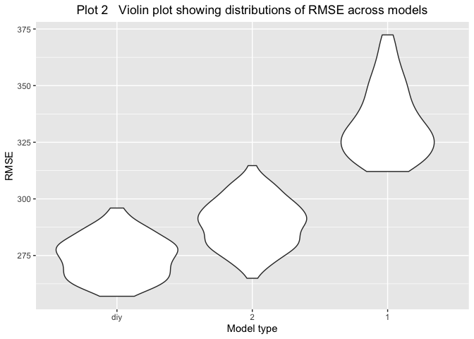
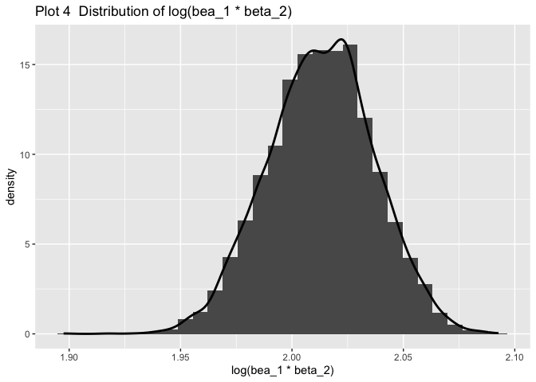

p8105\_hw6\_rq2166
================
Ruoyuan Qian
11/18/2019

``` r
birthweight = 
  read_csv("data/birthweight.csv") %>% 
    janitor::clean_names() %>% 
    mutate(babysex = factor(babysex,level=c(1:2),
                    labels = c("male","female")),
           frace = factor(frace,level=c(1:4,8,9),
                    labels = c("White","Black",
                               "Asian","Puerto Rican",
                               "Other","Unknown")),
           malform = factor(malform,level=c(0:1),
                    labels = c("absent","present")),
           mrace = factor(mrace,level=c(1:4,8),
                    labels = c("White","Black",
                               "Asian","Puerto Rican",
                               "Other")))
```

    ## Parsed with column specification:
    ## cols(
    ##   .default = col_double()
    ## )

    ## See spec(...) for full column specifications.

``` r
anyNA(birthweight)
```

    ## [1] FALSE

``` r
 fit = lm(bwt~.,birthweight)
summary(fit)
```

    ## 
    ## Call:
    ## lm(formula = bwt ~ ., data = birthweight)
    ## 
    ## Residuals:
    ##      Min       1Q   Median       3Q      Max 
    ## -1097.68  -184.86    -3.33   173.09  2344.15 
    ## 
    ## Coefficients: (3 not defined because of singularities)
    ##                     Estimate Std. Error t value Pr(>|t|)    
    ## (Intercept)       -6265.3914   660.4011  -9.487  < 2e-16 ***
    ## babysexfemale        28.7073     8.4652   3.391 0.000702 ***
    ## bhead               130.7781     3.4523  37.881  < 2e-16 ***
    ## blength              74.9536     2.0217  37.075  < 2e-16 ***
    ## delwt                 4.1007     0.3948  10.386  < 2e-16 ***
    ## fincome               0.2898     0.1795   1.614 0.106551    
    ## fraceBlack           14.3313    46.1501   0.311 0.756168    
    ## fraceAsian           21.2361    69.2960   0.306 0.759273    
    ## fracePuerto Rican   -46.9962    44.6782  -1.052 0.292912    
    ## fraceOther            4.2969    74.0741   0.058 0.953745    
    ## gaweeks              11.5494     1.4654   7.882 4.06e-15 ***
    ## malformpresent        9.7650    70.6259   0.138 0.890039    
    ## menarche             -3.5508     2.8951  -1.226 0.220083    
    ## mheight               9.7874    10.3116   0.949 0.342588    
    ## momage                0.7593     1.2221   0.621 0.534418    
    ## mraceBlack         -151.4354    46.0453  -3.289 0.001014 ** 
    ## mraceAsian          -91.3866    71.9190  -1.271 0.203908    
    ## mracePuerto Rican   -56.4787    45.1369  -1.251 0.210901    
    ## parity               95.5411    40.4793   2.360 0.018307 *  
    ## pnumlbw                   NA         NA      NA       NA    
    ## pnumsga                   NA         NA      NA       NA    
    ## ppbmi                 4.3538    14.8913   0.292 0.770017    
    ## ppwt                 -3.4716     2.6121  -1.329 0.183913    
    ## smoken               -4.8544     0.5871  -8.269  < 2e-16 ***
    ## wtgain                    NA         NA      NA       NA    
    ## ---
    ## Signif. codes:  0 '***' 0.001 '**' 0.01 '*' 0.05 '.' 0.1 ' ' 1
    ## 
    ## Residual standard error: 272.5 on 4320 degrees of freedom
    ## Multiple R-squared:  0.7183, Adjusted R-squared:  0.717 
    ## F-statistic: 524.6 on 21 and 4320 DF,  p-value: < 2.2e-16

``` r
variable = 
 lm(bwt~.,birthweight)%>% 
  broom::tidy() %>% 
  filter(p.value<0.05,
         !(term == "(Intercept)"))
  

 mod = lm(bwt~babysex+bhead+blength+
            delwt+gaweeks+mrace+parity+smoken,
          birthweight)
summary(mod)
```

    ## 
    ## Call:
    ## lm(formula = bwt ~ babysex + bhead + blength + delwt + gaweeks + 
    ##     mrace + parity + smoken, data = birthweight)
    ## 
    ## Residuals:
    ##      Min       1Q   Median       3Q      Max 
    ## -1119.67  -181.24    -5.87   173.51  2340.76 
    ## 
    ## Coefficients:
    ##                     Estimate Std. Error t value Pr(>|t|)    
    ## (Intercept)       -5822.5934    98.8325 -58.914  < 2e-16 ***
    ## babysexfemale        28.6609     8.4951   3.374 0.000748 ***
    ## bhead               131.6982     3.4607  38.056  < 2e-16 ***
    ## blength              75.8653     2.0210  37.538  < 2e-16 ***
    ## delwt                 2.2649     0.1961  11.550  < 2e-16 ***
    ## gaweeks              12.1400     1.4654   8.284  < 2e-16 ***
    ## mraceBlack         -146.7893     9.2435 -15.880  < 2e-16 ***
    ## mraceAsian          -71.5880    42.4809  -1.685 0.092026 .  
    ## mracePuerto Rican  -119.5979    18.7656  -6.373 2.04e-10 ***
    ## parity               98.6113    40.5334   2.433 0.015021 *  
    ## smoken               -4.7472     0.5882  -8.071 8.96e-16 ***
    ## ---
    ## Signif. codes:  0 '***' 0.001 '**' 0.01 '*' 0.05 '.' 0.1 ' ' 1
    ## 
    ## Residual standard error: 273.8 on 4331 degrees of freedom
    ## Multiple R-squared:  0.7148, Adjusted R-squared:  0.7142 
    ## F-statistic:  1086 on 10 and 4331 DF,  p-value: < 2.2e-16

``` r
birthweight %>% 
  add_predictions(mod) %>% 
  add_residuals(mod) %>% 
  ggplot(aes(x = pred, y = resid)) + geom_point() + 
  geom_smooth(aes(y = resid), color = "red")
```

    ## `geom_smooth()` using method = 'gam' and formula 'y ~ s(x, bs = "cs")'

<!-- -->

``` r
 mod_1 = lm(bwt~blength + gaweeks,birthweight)
 mod_2 = lm(bwt~bhead + blength + babysex + bhead*blength + bhead*babysex + blength*babysex + bhead*blength*babysex ,birthweight)
```

``` r
cv_df = 
  crossv_mc(birthweight, 100) 

cv_df %>% pull(train) %>% .[[1]] %>% as_tibble
```

    ## # A tibble: 3,473 x 20
    ##    babysex bhead blength   bwt delwt fincome frace gaweeks malform menarche
    ##    <fct>   <dbl>   <dbl> <dbl> <dbl>   <dbl> <fct>   <dbl> <fct>      <dbl>
    ##  1 male       34      48  3062   156      65 Black    25.9 absent        14
    ##  2 female     36      50  3345   148      85 White    39.9 absent        12
    ##  3 male       34      52  3062   157      55 White    40   absent        14
    ##  4 female     34      52  3374   156       5 White    41.6 absent        13
    ##  5 male       33      52  3374   129      55 White    40.7 absent        12
    ##  6 female     33      46  2523   126      96 Black    40.3 absent        14
    ##  7 female     33      49  2778   140       5 White    37.4 absent        12
    ##  8 male       36      52  3515   146      85 White    40.3 absent        11
    ##  9 female     35      51  3317   130      55 White    43.4 absent        13
    ## 10 male       35      51  3459   146      55 White    39.4 absent        12
    ## # … with 3,463 more rows, and 10 more variables: mheight <dbl>,
    ## #   momage <dbl>, mrace <fct>, parity <dbl>, pnumlbw <dbl>, pnumsga <dbl>,
    ## #   ppbmi <dbl>, ppwt <dbl>, smoken <dbl>, wtgain <dbl>

``` r
cv_df =
  cv_df %>% 
  mutate(
    train = map(train, as_tibble),
    test = map(test, as_tibble))
```

``` r
cv_df = 
  cv_df %>% 
  mutate(mod_diy  =
           map(train,~lm(bwt~babysex+bhead+blength+delwt+gaweeks+mrace+parity+smoken,data = .x)),
         mod_1  = 
           map(train, ~lm(bwt~blength + gaweeks, data = .x)),
         mod_2  = 
           map(train, ~lm(bwt~bhead + blength + babysex + bhead*blength + bhead*babysex + blength*babysex + bhead*blength*babysex ,data = .x))) %>% 
  mutate(rmse_diy = map2_dbl(mod_diy, test, ~rmse(model = .x, data = .y)),
         rmse_1 = map2_dbl(mod_1, test, ~rmse(model = .x, data = .y)),
         rmse_2 = map2_dbl(mod_2, test, ~rmse(model = .x, data = .y)))
```

    ## Warning in predict.lm(model, data): prediction from a rank-deficient fit
    ## may be misleading

``` r
cv_df %>% 
  select(starts_with("rmse")) %>% 
  pivot_longer(
    everything(),
    names_to = "model", 
    values_to = "rmse",
    names_prefix = "rmse_") %>% 
  mutate(model = fct_inorder(model)) %>% 
  ggplot(aes(x = model, y = rmse)) + geom_violin()
```

<!-- -->

# Problem 2

``` r
weather_df =
  rnoaa::meteo_pull_monitors(
    c("USW00094728"),
    var = c("PRCP", "TMIN", "TMAX"),
    date_min = "2017-01-01",
    date_max = "2017-12-31") %>%
  mutate(
    name = recode(id, USW00094728 = "CentralPark_NY"),
    tmin = tmin / 10,
    tmax = tmax / 10) %>%
  select(name, id, everything())
```

    ## Registered S3 method overwritten by 'crul':
    ##   method                 from
    ##   as.character.form_file httr

    ## Registered S3 method overwritten by 'hoardr':
    ##   method           from
    ##   print.cache_info httr

    ## file path:          /Users/ruoyuanqian/Library/Caches/rnoaa/ghcnd/USW00094728.dly

    ## file last updated:  2019-09-26 11:10:51

    ## file min/max dates: 1869-01-01 / 2019-09-30

``` r
weather = 
  weather_df %>% 
  select(tmax,tmin)
```

``` r
#boot_straps = 
#  weather %>% 
#  modelr::bootstrap(n = 1000)

#as_data_frame(boot_straps$strap[[1]])

#a = lm( tmax ~ tmin , data = weather) 
#summary(a)
#tidy = broom::tidy(a)
#b1 * b2
#prod(tidy[[2]])

# r2
#broom::glance(a)[[1]]

estimate = 
  weather %>% 
  modelr::bootstrap(n = 5000) %>% 
  mutate(
    models = map(strap, ~lm( tmax ~ tmin , data = .x) ),
    results = map(models, broom::tidy),
    glance = map(models, broom::glance)) %>% 
  select(-strap, -models) %>% 
  unnest(results,glance) %>% 
  group_by(.id) %>% 
  mutate( log_b = log(prod(estimate))) %>% 
  ungroup(.id) %>% 
  select(r.squared,log_b) %>% 
  unique()
```

    ## Warning: unnest() has a new interface. See ?unnest for details.
    ## Try `df %>% unnest(c(results, glance))`, with `mutate()` if needed

``` r
estimate %>% 
  ggplot(aes(r.squared,..density..))+
 geom_histogram()+
 geom_line(stat = 'Density',size = 1)+
    labs(x = "R squared",
         title = "Plot 1  Distribution of R squared")
```

    ## `stat_bin()` using `bins = 30`. Pick better value with `binwidth`.

<!-- -->

``` r
estimate %>% 
  ggplot(aes(log_b,..density..))+
 geom_histogram()+
 geom_line(stat = 'Density',size = 1)+
    labs(x = "log(bea_1 * beta_2)",
         title = "Plot 2  Distribution of log(bea_1 * beta_2)")
```

    ## `stat_bin()` using `bins = 30`. Pick better value with `binwidth`.

<!-- -->

``` r
n = 
estimate %>% 
  pull(log_b) %>% 
  length()

order(estimate$r.squared)
```

    ##    [1] 4441 1309 1062 2068 4671 3963 2930 3940  246 4314 2260 1765 3581
    ##   [14] 3769  813 1167 4633  736  360 3103 2225 1394  720  796 1482 4388
    ##   [27] 4935 2258 3484 2476 1306  902 1967 3905 1626  717  924 1522 1849
    ##   [40] 2008 4395 3194 2693 1478 2378  983 2923  820 3836 3878   86 4237
    ##   [53]  450 1434   57 3854  427 2493 1307 3639 1193 2341 1966 3499 1187
    ##   [66]   68    4 2605 3880 4361  895  779 2273 2479 2871  573  591 4847
    ##   [79] 2500 1707 3627 3986 3102 2461 1219 2542 3193 3602 1014 4859 3703
    ##   [92] 4950 4900 1465 4684 1194 3362  839 3392 2676 2361 2877 3298 3844
    ##  [105] 4364 2902 4296 2575 3306 1160 4461 1252 1549 1458  334 4523  927
    ##  [118] 1670 1174 4618 3505 2426 3519 4970 1994 3520 4023  727 1718 3038
    ##  [131] 2078  270 1195  709 1604 3233 3894 3398  896  828 2538 1721 2101
    ##  [144] 3914  202 3549 4594  872  149 4942 1238  466 1110 3360 3425 1242
    ##  [157] 2790 1125 3382 3083 1019 2302 4766 1056 1347  517  272 1941    2
    ##  [170] 3105  467 2442 3652 3573   43 1709 2652 2638  662  324 4241 1637
    ##  [183]  430  308 1764 3181 4956 4106 1812  423 4336 2381 4194 4511 3145
    ##  [196] 3955 2122 3558 4515 2188 2924  851 2888 1968 3307 4047 1793 1863
    ##  [209] 4698  418  713 2855 1270  236 4631 4999 2719 1537 2462 2015 3708
    ##  [222] 1677 3544 3225  493 2785 4542  543   11 1803 1701 4446 3563 4608
    ##  [235] 4285 3326 4284 2640 1801 3468  222 2907 3593 4932 4580 2180   25
    ##  [248] 4899 2077 1132 2999 3358 3669 2744 3413 3908  692 2439 1467 3864
    ##  [261] 1529 3143 2457 2522  938  803  201 3780 4680 2404 3384  859  761
    ##  [274] 2470 2464  231 2497 3655 1261 1978 2283 4867 1098 1127 3019 3712
    ##  [287] 3823 1124 2371  521 1102 2978 2867  649 4067 3547 4512 3041 1213
    ##  [300] 4371 1251 2436  283 1265 4089 3060 3401  163  582 1445 2269 4781
    ##  [313] 3319 4650 1706 4182 1625 1151 3314 4540 1643  233  679 2901 1811
    ##  [326] 2054 2158 1971 2631 3771 1254  871 1834  550 3229 1176 1295 4386
    ##  [339] 3119 2669 4982 2692 2857  789 4779 4214 1974  929 2916  551 2909
    ##  [352] 2682  223 4840  372 4862 1016 4417 1623 3304 3402 3354 4545 1041
    ##  [365] 2228 4320 4092 2205 1843  989 3064 2447 1759 1847 4700 1640 3745
    ##  [378] 4045 1291 3808 1105 1408 3629 2566 1720 4792 4892 2071   75  288
    ##  [391] 3966  319  129 3074 1095 3913 2840 3801 2889 4553 2103 4302 4852
    ##  [404] 2971  563 3984 4460 4804 3056 3133 2417 2659 4433  130  911 4403
    ##  [417]  421 4701 4607 2786 1363 3814 1026 2013 1276  150  214 2738 4213
    ##  [430] 4820 2155  187 3551  654 2577 4977  696 3284 1964 4419 1462 2955
    ##  [443]  506 2611 2710 4813 4118 2152 2353 4870 4463 3781 4614 1550 2716
    ##  [456] 2720 3906 3076 1868 1769   69 3198  572 3779  921 4717 2859 4574
    ##  [469] 1248 2763 4762 2918 3776 2036 2656  464  601 2523 3444 3528 4519
    ##  [482] 4562 3617 3917 2911 4502 1872 2917  533 2483  261 2740 4494 3934
    ##  [495] 1245 1382 1688 4148  990 1671  157 4014 3018 3498 3741 4292 1756
    ##  [508] 1905 1071 3571 1992 4497 2377 1190 3269 2079 4682 1066 4122 4251
    ##  [521] 1155 3719 4787 1498 4377 4975 4758 2668 2894 4827 4246  584 2109
    ##  [534] 4466  131 1607 1619 4004  332 4328 3597 4709 4005 1832 2123 4538
    ##  [547] 1813 3959  264  647 3289 3516 2548 4905 2340  663 3375 3898 4734
    ##  [560] 2937  666  204 2336  807 2619 4097 1484 2764  291 3238  823   18
    ##  [573] 2874  227 4276 3595 1943  578  576 3868 1494 4742 4299 2351 4138
    ##  [586]  478  968 1627  213 2316 1116 1253  653  181 3695 3013 2779 2422
    ##  [599] 2608 4051  358 4919 4087 4228  659 3899 3175 4030 4481 3000 1178
    ##  [612] 4437  502 3122 1123 2774 3815 1752 4691 1644 1921 3672 2551 1908
    ##  [625] 2331 4844  962 2129 1892 2967  328  143 4179 4598 3555 4983 2604
    ##  [638] 4058 2803 2056 1944 1140 2824 3452  675 3630 4318 3514  527  752
    ##  [651] 2781 4797  600 3053 2783 1915  522 2414 2572 4412 3173 1180 1758
    ##  [664] 2469 4785 1618 1630 2370  855 4836 2428 1483 4788 1570 2747 4639
    ##  [677] 4007    1 4850 4953 4483 2987  602 2019  443 1130 3953 4327 2633
    ##  [690] 4402 4321 2602 4153 4752 1880 4831  303 2684 3149  949 3970   15
    ##  [703] 4120 2712 2276 4392  562   24 1076 3706 4094 2201 4854 4142 1595
    ##  [716] 1686 4603 3524 4809 1527  583 4759  658 1317 4884 1471 1429 2586
    ##  [729] 4723 4104 3265 2737 2852 3241 4022  840 4013 1061 4268 2610 1336
    ##  [742] 3736 1300 4904 3759 4907 1379 4773 4275   35 3207 4163 1761 3806
    ##  [755]  365 2520 1957 1022 4612 3317   76 3888 2232 2467  978  425 2540
    ##  [768]  940 3295  390  162  976 3883 3892 4083 2869 2663 2094  353  829
    ##  [781] 2561  714 3418 4777 3357 1211 3132 2262 4021 3684   79 3475 4363
    ##  [794] 4722 4096 3112 2001  422 2087 1631 4311  570 3872 4282 3987 4315
    ##  [807]  156 3647 1896 4207 2645 1169 1743 3900 2048 1278 3638 2958 1414
    ##  [820]  479   23  275 1774 1063 3758 4398 1172 3302 3205 2718 4462  863
    ##  [833]  644 2823 1196 4989 4625 2023 2851 2159 2945  545 3011  510 1987
    ##  [846] 4049  756 1162  313  745  281 2703    9 1138 4611 4103 4121 4008
    ##  [859] 4333  161 2230 2846 2769 3811 1963 4038 3200 4565 2849 2323 3932
    ##  [872] 2003  298 2791 3016 3479  715 4267 4345 4028 1999  445 2174 4560
    ##  [885] 3204 1602  416 3545 4782 3070  513 1666 1830 4485  941 4346 3910
    ##  [898]  699 1986 4786 2399 1392 4416 2288 2084 1951  380 4062 1466 2135
    ##  [911] 2375  152 1343 4503 4516  998 2890 3073  254 1079 2962 4587 1594
    ##  [924] 2567 2202 2355 3138 3489  790 3080 2908 1250 3881 4405  994   39
    ##  [937]  405 3421 1937 2679 4610 3208  193 2675 1838 4489 2010  691 2251
    ##  [950] 2922 1092  435 4039  338 3379 3534 2905 3433 3929 2928 3907 2171
    ##  [963] 3332 4662 1241 2389 3232  354 2964 4653  415  566 2690 3697 2876
    ##  [976] 4131  382 3732 3682 3895  876 4037  643 4385 1653 1932 1883 2713
    ##  [989]  610 3589 3722 3948 3949 3663 4369 4218 4705 2382 4313 3110 2685
    ## [1002]   55  629 4730 3787 4544 1841 3001 3028 4789 2622 1884  913 3674
    ## [1015] 1012 2598 1596 4468 4675 1649 3738  396 2165 2125 4509 4704 3548
    ## [1028] 3318 1930 2806 1750 2144 2175 1509 3478 4726 3538  511 3115 4300
    ## [1041] 1503 3599 2505 4889 2059 4651 4293 4145  534 4853 3117  732  632
    ## [1054] 2027 2309 4380 4397 4643 2176 3606 3260 1179 3164 4911 2280 3427
    ## [1067] 4243 2989 3032 1799  155 2975  217 1805 2321 3325 3300 1263 3455
    ## [1080]  914 3795  147 4976 1387 2534 3735  347 1468 3926 4185 2287 2957
    ## [1093] 2217 3526 2454 3219 3266 4196 4459  557 3024 1431 4435 2067 2595
    ## [1106] 4793 4798  110 2119 1198 2050  118 3873   63 4031 1953 1350 1735
    ## [1119] 1828 2868 4938 4054 2519 4479  386   52 1314 4584  190 4821 3395
    ## [1132] 3136 4326 2649 3827 2942 4874 3717 3167 2402 1491 4176 4909  987
    ## [1145] 3504 3699 2248 1510 4559 2073 4799 1326 1346 1865 2097 2695 3169
    ## [1158] 3692 1887 4168 1698 3488 4945 4623 3467 1237 3137 3803 2765  438
    ## [1171] 3587 1917 1007 1651 3957  984 3451 1646 3381 4216 1946 2093   33
    ## [1184]  165 1181 1189 2002 2474  106 2053 4903 3818 1113  455 3089  526
    ## [1197]  681 3075 2460 1567 2585 2757 1553 2057 2455 4232 1145 1084 1927
    ## [1210] 3819 1473 4101 2268  826 2501 1464 2798 1266 4010 1274 1047 2843
    ## [1223] 3294  234 3842 1534  400 2365 4677 1919 3988 3416 4192 1935  250
    ## [1236] 4002 3420 3081 2117 2864 4127 4796 1673  611 4748  970 2162  350
    ## [1249] 3975 1284 3093 1810 3237 3886 1050 2677  664 1554  437 2141  633
    ## [1262] 1410 2775 4306 3831 4579 4895 1093   27 2974  650 1040 4802 1851
    ## [1275] 1378 2317  731   61 2184 2213 1822 1082 2060 2207 4930 3356 4352
    ## [1288] 1203 2865 3586 2565 3902 4316 3407 1365  710 3756 1806 4966 1249
    ## [1301] 1074 2948 3491  115 2150 2741 1352 3816 1448 2385  952 2635 3042
    ## [1314] 2547 3397 4265 1983 4772   91 4526  808 2729  993 4140  574 4181
    ## [1327]  997 2400 3813 1997 2734 2181 4003 1164 1121  909 3788 2895 2295
    ## [1340] 1091  592 1989 4329 3568 1107 4876  615 2582  596 4491 4507 4492
    ## [1353] 2993 1576  248 1042 2161 3752 3767 1002 3572 3428  567 3459 4657
    ## [1366] 4309 4378 2594 4913 4458  331  538  724  428 1285 2753 3825  986
    ## [1379] 3470 2766 1323 4986 2411 2240 3377 4531  598  802  532 2086  485
    ## [1392] 3990 1035 4695 2535 4838 2858 3321 3274 3025  725 4990 3619 2841
    ## [1405] 4254 4042 4178 1539 1088 1751 3707 4988 2617 1606 2471 4776 1654
    ## [1418]  367 2549 4539  795 2042 4849  158 1220 3797 3704 2756 1337 3030
    ## [1431] 3935 3763 4454 3415 2714 4845 2653  266 1081 4696 2022 1705 1715
    ## [1444] 1780 2706  982   81 3052  470 3928  616 1690 1369   28  397 1525
    ## [1457] 1898 2689 4353 4393 4576 3782 1319 2615 1840 3661  385 2310 2391
    ## [1470] 3611 1712 4478 1212 3182  257 1945 1318 3730 1824 4563 2960 3991
    ## [1483] 2284 2186 1331 1383  860 1011 2333 2661 2134 4035 1023 2182 3363
    ## [1496] 1577 3598 4359 4963 1779 4656  575 2507 3141 1976  708  277  505
    ## [1509] 2625 1598 2550 4050 3721 4936  210 2005 2279 4334  148  247 2829
    ## [1522]  359 4354 2600   92 4234 2589 3846 1657 3254 4819 4581 1430   13
    ## [1535] 4429 4410 4486 1119  468 3920 2691 1853 1939  104  590 2503 1070
    ## [1548] 1886 3086 4074 3196  985 4287 4871 2383 1955 4521 1620  890 3668
    ## [1561] 1469  141 1560  888 4250 1247 3429 1072 4979 4211 4220 2593   45
    ## [1574]  103 2449 2033 3733 1165 3057 4337 1873 4210 2628 4152  904 2532
    ## [1587] 4609 1455   83 4693 3239 1418 1235 1977 2463 4810 2256 3171 4297
    ## [1600] 4161  861 2508 4506 1476  925 2098 1388 2796  492 4984 4708  751
    ## [1613] 2475 2203 1821 4955 2544 4060 1546  504  778  780 2934 1118 2629
    ## [1626] 3660 4604 2885 2413 2968   72 4920 3339 2191 4829 3539  917 3153
    ## [1639] 1052 1461 4183  748 1878 2347 1480 2427 3044  980 4139 1231 1857
    ## [1652] 3066 3174 2856 4289 1956  864  620 2521 4253 3473 1497 3285 2362
    ## [1665] 4634 4951 2387 2121 1894 2815 2105 1340 1561 3333  449 1426 3142
    ## [1678] 3264  173 3125  801 3010 2486  542 4024  799 2325 2195 4569 2332
    ## [1691] 2826 2070 4663 2642 3592 4995  712 1444 3701 4962 2721 2560 1517
    ## [1704] 4573 3129 1475 3148 3954 1881  549 3718  101 2562  408 4404  738
    ## [1717] 4940  673   31 4322 3764 3608 1422  618 3279 1143 4001  273 2935
    ## [1730] 3685 3095 1719 3874  139  975  477  837 4670 2009 1579  758 2055
    ## [1743] 1141 4957 3941 4739 1663 1214  170 4961 3059  482 3607 2234 1871
    ## [1756] 1487  690 3272 3077  515 2318  857 4440 4794 4470 3625 1749  879
    ## [1769] 1438 2655 1126 1551  389 3518  220  875 4156 3262 3431 2406 4600
    ## [1782]  547 4897 4018 2193 4690  355 3048 2481 4225 3054 3577 2147 4340
    ## [1795] 2576  595 4200 2831  539 4130 4263 3610 2539 3511 4750 2818 2239
    ## [1808] 4141 3227  167 2707 3347  775 3209 4688 4069  260 3512 4032  440
    ## [1821] 1262 3766 2115  728 4465 1762  368 2364 1192 3252 2886 1057 2408
    ## [1834] 3121 4720 2065 1454 3901 4621 3343 3772 2487 3275  850  723 2177
    ## [1847]  651 4277 4916 3368 4193 3640 3202 2102 2496   48 2996   38 2919
    ## [1860] 3615 4619 3739  961 3021 4432  373 2337 3071 1692 1199  963 3866
    ## [1873] 2789 2226  499 1301  171 2429 3742 1736 4286  244 1115  680 3837
    ## [1886]  488 4303 3039  939  931 1929 2224  186 3273  792  198  544 3680
    ## [1899]  229 1731 4255 1920 1569 1298 4086 4197 3441 3422 1428 1786 3116
    ## [1912]  995  754 4595 3255  891  564 1819 2172 4556  825 4295 3681 3510
    ## [1925] 1972 2322 2800 1912 2545 4585 2596 1229 3337   21  794 1025   58
    ## [1938]  530 3268 1662    3 4020 2970 1097 3533 4169 3570 4119 1574 3438
    ## [1951] 1624 4883  108 3313 2730  920 1051 1565 4524 4331  683 4660 3700
    ## [1964] 4376 4886 1289 1568 3696 1441 1800 4430 3716 3635 3151 2108 4298
    ## [1977] 1728   41  887 4567  604 1362 1202 3430 2543 1459 3108 2814 4528
    ## [1990] 2875 2722 1909 1807 2064 4350    7  689 1244  612 3791 4839 4812
    ## [2003] 3600 1729 4165 1109 3316 3989 3833  897 3426 4714 3613 1991  958
    ## [2016] 3543 4555 1885 3785 1223 2564 3162 1877 2266 1672 4271 1552 3296
    ## [2029] 3985 3576   20 2209 2366 2623 3969 3869 2644 3014 2556 2506 3673
    ## [2042] 3508  571 3374 2424  558  123 2807 3246 3036 4824   36 1506 1926
    ## [2055] 2795    5 1335 4063 3390 3947 2979 3662 3465 2825 3101 2214  704
    ## [2068] 1282 4615 1481 2173 2092  771  111 3292 1156  672 2000 4428 4672
    ## [2081] 4075  759 3800 3677 4826 3556  627 3554 1650  301 2525 4044 1312
    ## [2094]  407  122 2196 2237  197 3634  762 4954 1087  740 4946 3152 4177
    ## [2107]  228 4100 3403 2804 4882 2514 2166 1538 1290 1531  798 3191 2733
    ## [2120] 4366 2742 3389 1555 4170 4620 3896 2452 4765  898 1771 1442 3287
    ## [2133] 3243 4379 3830 1858 1682 2379 4833 3789 3017 3849 4757 4464 3359
    ## [2146]  495 1371  529 4518 2822 1217 2024 3258  323 4373  160  512 1488
    ## [2159] 1586 3951 1532 2588 4355 4751   71 3214  782   93 4910 1068  787
    ## [2172]  361 2291 2509 3364 4088   37 3412 3144  395 1146 2531 2574  274
    ## [2185]  957  950 2392 4557 3687 1349 1293 2045 1740 1477 1727 1456 1396
    ## [2198] 1144 3977 2662 1493 2537 3257 2931 2247 1377 3496 1512 3553 3201
    ## [2211] 1680  806  406 3821 1142 4358  991 3750 3386 4856 2938 1679 2842
    ## [2224] 4367 3424 4914 3261 1120 1693 4079 2863 3822 1058 1899 2363  874
    ## [2237]  134 1609 3626  624 3500  176 2530 1279 4861 2658  383  784  420
    ## [2250] 3378  809 3369 4868  737 1925  894 1386  766 2954 1385 3394 2041
    ## [2263]  652 2784 3650   96 1703 3446  668 2453 2415 2950 1045  743 3724
    ## [2276] 4943  219 3439 3330 2311 4969 2701 1548  971  519 3998 1017 1732
    ## [2289]   95 4208 1310  763 4616 2891 3786  442 2723 1320 3211  637  838
    ## [2302] 1485 1129 4520  817 1796 1209 3879 1621 4801 4407 2511 4774   98
    ## [2315] 1958  391  448 4972 4756 2242 3773 3161 1990  267  716 2949  168
    ## [2328] 3942  910 3976 3046 1716 1381 4947 1948 1333  206  153 1053 3506
    ## [2341] 4357 3536 3434  159 4291 1268 3218 1400  769 2940 1996 4673 1733
    ## [2354] 1734 3177 1055  735 1683 2357 1440 3157 3792 4057   77   54 2130
    ## [2367] 2335   66 1020 3350 3820 3702 3509 1453 3727 2832 2274 1836 4484
    ## [2380] 2307 1831 2755 2111  548   29 2354 2220 3139 4495 2096 3557 1835
    ## [2393] 3411 4771 3179 4865 3166 3335 2149 2943 2821   34  626  892 3236
    ## [2406]  640 3529 1168  140 3931 4731 4778 2700 3184 1879  182 1973 1696
    ## [2419] 3950  413 2820  491  836 4931  854 2782  497 3187 3502  146  145
    ## [2432] 1578 3463   94 1737 2178 2441  791 1427  711 2494  685 3490 4952
    ## [2445] 1845 4248 3094 3744 1341 4084  224 3058 2278 3875 2992 3911 2409
    ## [2458] 1412 1652 2451 3040 1134 2932 1790 1024 1660  402 4514 4570 4869
    ## [2471] 3958 1332  203 1557 1027 3311  992 2817 2255 4137 3486 4400 4654
    ## [2484] 3720  113  535 4372 2006 2270 3033 1005 3614 2390 3097 3978 3909
    ## [2497] 1730 4501 4749 4040 4968 1936 3447 2029 1590  694  352 3961 4918
    ## [2510]  463 1152 4449 2127 4451 4368 1018 4676 1359  877 1513  631 3637
    ## [2523] 3050 2533 1862 3664 1226 4082 3234  289 2359  333 1768 2352 4775
    ## [2536] 1399 2976 3956 3249  398 3051 2794  822 1373  967 2032 4628 2046
    ## [2549] 2492   51 2694  956 4648 1591 4582 1508 3305 4080 2705 4622 2286
    ## [2562] 3693 2717  175 2374  862 3203 1668  764 4258 3399 4473 1439  785
    ## [2575]  374 2699 3743 1236 1294 3753 2698  475 4807 1922 4764 4180 2004
    ## [2588] 1411 2099 4009 4312  868 2819 1559 2853 1530 3485 1389 1605 2020
    ## [2601] 3251 1777 4697 4535 3683 2249 3841 2828 3503 3594 3127 1949 3569
    ## [2614] 1597 3192 3861  310  560 1433 4879 1186 1153 4994 2947 1006  377
    ## [2627] 1345  520 4949 3515 1918  393  869 1390 3111 3995 4212 1351  606
    ## [2640] 1147 3315 4855  818 2854 2345 2517 2393  235 4642 2760 4347  453
    ## [2653] 3477 4727 4888 1275 1303 1435  215 2356 1655 1420 1526 2728 2206
    ## [2666] 3889 1906 4543 1817 3216 2154 3561 2072 2021 1133 4029  906  262
    ## [2679] 2143  918 1131 1099   26 4941 4107 4188 3623 3223 2597 3476 3331
    ## [2692] 2639  665 4912 1065  742 2990  848 1833  834 4236 3085 4262 2277
    ## [2705] 3393 3099 2304 1415 4558  569 4249 2959 4783 1264 2805 3029 4499
    ## [2718] 3355 3308 1582  922 4259 2579 4443 1524  195  329 2988 3651  767
    ## [2731] 1647 1839 2187 3834 1773 4685  777 3323 2016  501 1009  474 3049
    ## [2744] 4828 3170 4806  304 3981 4627 1502 1449 2329 2591 4135  885 3726
    ## [2757] 1073 2163 3061 4198  988  858 4505 3867 1451 2030 1397 1753 4493
    ## [2770] 3109 1725 3276 3713   74 4754  741 3376 1931 4602 2472 3960 1866
    ## [2783] 1687 4091 1315 1676 1535 4641 2627  912 3542  200 4934  343  589
    ## [2796] 2736 1059 1954 4382 4554 4590 1575 3832 3858  959  687  755  873
    ## [2809] 1499 3857 3667 4537 2941  951 3761 2835 1230 1846 2018 1713 4149
    ## [2822]  399 3353 4974 1755  969 3165 3523 4687 4171 4204 4370 2264  889
    ## [2835] 2120 1788 3031  974 1398 1859  788  325  439  935 4761 1854  960
    ## [2848] 1757 3327 1742 2252 2727 4933 4548  677 2797  306  253 1489 4948
    ## [2861] 1355 3796 4552 4578 3015 4229 3361 3579 3723 1277  133 2526 2243
    ## [2874] 3461  280 1299 3924 2342 2294 4808  676 2113  109 1228 1639 3945
    ## [2887] 4547   32 2834 4159  926 2416 1648 1970 1419 4158 1038 1404 1372
    ## [2900] 4474 4396 1158 1874 2860 3552 4740  444  434 3862 2386 4487 1232
    ## [2913] 1844 3007  356 3123 4052 1334 2082 1519 4586  933 4686  337 4421
    ## [2926] 1370 1417 2845 1795  661 4805 2167 4420 1001 4791 2185 2696 1366
    ## [2939]  667 2380 2412 1406 2739 3848 3653 1043 1054 2236 4406 4561 4456
    ## [2952] 1413 3943 2657 2749 3450 2037 4186  886 2618 4699 4617 1159 1562
    ## [2965] 4070 4264 3923 3658 2758 1486 1452 1188 4496 1327   99 3309 3527
    ## [2978]  230  462 2837 1111 4689  209 1741 2478 4893 2292 3865 3147   78
    ## [2991] 2313 3135 4527 2440 1891 4442 4307  265 3084  682  774 3106 4901
    ## [3004] 3622  613 2878 3406   14  953 4550  500 1046 1114 4694 4151 2898
    ## [3017] 2110 4166   97   44 3282 2994 1148 3933 3992 2434  757 3643 2780
    ## [3030]   60 1656 4713  117  937 1809 1135 3817 1324 3646  441 3925 2982
    ## [3043] 3904 3530 1243 1342 2927    8  498  867 1239 2601 2007 3790  856
    ## [3056] 3794 3185 4226 1305 4638  483 2259 3134 2285 3507 3517 1325 3835
    ## [3069] 2052 2468 4851 1564 3591  540 3654 3749 3156  702 1766  419 3737
    ## [3082] 3068 1738 3342 2049 1875 4000 3303 3140 2516 3220  302 4733  363
    ## [3095] 1901 4928  559 2137 2423  670 3665 3492 2621   46 2951 2912  128
    ## [3108] 4780 2419  932  424 3288 4822 4154 1104 2504 4174 1681 1166  815
    ## [3121] 2557 3131 4043 3336  973 2910  284 2906 1889 2300 2986   12  901
    ## [3134] 2839 1601  830 3322  508 4342 1207 2297  293 4187 1924 3678 2678
    ## [3147] 3852 2312 2218 2116 2578 2106 3636 4763 2899 3419 1580 4997  800
    ## [3160]  812 3020 2637 1785 3855  744 3616 3190 3532  221  154 1446 1029
    ## [3173] 4111 4728 4233 4571 1514  804 2985 4157 4072 2299 4452  459 4374
    ## [3186] 1667 3118 2330  136 4279 2376 3417 3853 1436 1402 4027 3471 1754
    ## [3199] 3540 3838 1000 3582  509 3188 2850 3023 1100  903 1916 3670 1855
    ## [3212]  821 2466  853 1684 2344 3747 3565  553  878 4308 4076 1714  641
    ## [3225]  114 1240 2570 3774 3624  880  580  371 2254 4669 1837 4025 3609
    ## [3238] 2244 2403 1034 4917 4922 2369 3620 2650 3525 4409 3938 3802  100
    ## [3251]  655 1200 3657 2241 3245 1031  656 1283  964 4490 1137 2848  531
    ## [3264]  394  172 3454 4719  556 1633  496 1816  320 1391 4746  370 1037
    ## [3277]  768 4362   84 3449 4915 1269 2293 3372 4414 2384 4658   56 2583
    ## [3290] 1479 1556 3002 2827 1635 3349 3731 1642 2480 3248 3172 4098 3715
    ## [3303]  126 4624 1344 3939 2142 2435 3259 3113  240 3098 1108   59 3946
    ## [3316] 1096  348 4349 1980 2327 3410 4566 1699 3824 1615 2673 3481 4469
    ## [3329]  996 3213 4280 3277 2518 4053 2926 1401 2204 2456  645  686 2620
    ## [3342] 3474 4885 1641 4304  199 2031 2711  189 2190 3096 3631  936 1975
    ## [3355] 4770 2743 4613 3217 1739 3575 4155 1767  458 2735 4335 2502 4128
    ## [3368]   85 1384 4434 2272 3469 4592  833 2624 1316 1460 3826 1374 2751
    ## [3381] 3765 3448  376  471 4532 3840 4238  135 4510 3605 3964 1136 1357
    ## [3394] 1962  528  746 1933 1227  634 1393 1432 4902 2038 1815  865  760
    ## [3407] 1083 3996 1543 1039  484 3226  783  579 3324 1923  481 2568 4674
    ## [3420] 3128 2921 3286 3104  451 4517 4991  327 2925  966 2870 3628 4105
    ## [3433]  979 3751 4017  460 3671  866  207 2346 3621 4832 2153 2991  831
    ## [3446] 3338 4823 3189  102 2914 2303 2903 3887 3168 3876 3087 1281 2792
    ## [3459] 4191 1665  282   65 3012  137 1106 4143  646 2281 5000   19 2725
    ## [3472] 2445   70 2095  121  965 1965 3944  930 4549 2338 1501 4987 2768
    ## [3485] 1437 4332 4132 1360 2238 3535 3688  296 1407 1827 3003 1675  379
    ## [3498] 1470 4160 1981  317 4846 4124 4383 4317 2091 3320 1528  364 2219
    ## [3511] 4908  286 2966 3442 2961 4678 3760 3270 3409 1409 4418 2080 3531
    ## [3524] 1163 2592  674 3043 3130  721 3936 2418 1585  185 3590 3183 4093
    ## [3537] 1416 1794 2484  271 1364 1173 3770  191 4864 1182 3588 3983 1367
    ## [3550] 2893 1814 4195  607 3560 2873 3618  749 2552 3675 4348 2750  120
    ## [3563] 4572 1330 1094 3559 4894 1286 4203 3437 1257 3734 3008 1222 2946
    ## [3576] 1566 3063 3982 2688 1659  565 2398 2772  429 3088  414 2762 1645
    ## [3589] 4257 2421 1661 1495 4110 2830 4881 3230  480 4217 3408  179 3541
    ## [3602] 3253 2450 3334  642 2112 2499 2326 1808  164 2088 1573  700 4800
    ## [3615] 4939  107 4967 1599   67  814 3383  625 4768 3897 4113 4769 4109
    ## [3628]   73 4012 4252  599 2881 3472 3380 4205 1669 2407 1511 2168 4273
    ## [3641] 1216 1691  279 3348 2632 2373 2495 2641 4921 1090 2394 1789 2488
    ## [3654]  388  916 4649 1890 4099 3483 4431 2546 2425 2179  196 2569  258
    ## [3667]  805 2025 3404  457 3482 3915 2261  384 4551  827 4702 3916 2666
    ## [3680] 3851 4048  269 4423 4422 2058 1746  923 3921 4707 1781 2674 4059
    ## [3693] 2358  603 1907 1358  487 1674 2265 4710 4683  841 2748 1797 2334
    ## [3706] 1540 3937 2308  309 2745  585 3740 2296 3501 1571 1893 3400 1724
    ## [3719] 1826 1928 1101 3091  514 4384 2372 1308  294 2061 2913 4863  489
    ## [3732] 4081 3828 4356 3464  226 3641 4136 3351   10 3432 4330 2482 3784
    ## [3745] 3297 1722 2319 4215  698 2527 1993 2584 2192 4247 2136  276 3082
    ## [3758] 4811 4261 3186 4006 4310  507 3035 1215 2433 1150 2360 2963 1450
    ## [3771]  184 4477 3967 2697 3215 2799 3798 3263 2573 4737 1013 1064 2430
    ## [3784] 4711 1536 1969 1520 4077 2767 1603 3877 3891 3729 2984 4692 3027
    ## [3797] 4224 2324 2438 1185 4872   30 3783 1588 4457 2892 3487 1032 1177
    ## [3810]  151 2216 4288 4189  245 1592 1225 2524 1856 2367 4814 4842 4659
    ## [3823] 4646 4878 3666 4230  119 2810  639 4605 3235 1067 3293  614 4601
    ## [3836] 2133 4667 3839 1233 1747 2128  747 2512 3578 4055 2282 2776  999
    ## [3849] 1515 3691 2599 1783 2157 1368 3698 1842 3884 4269  972 2510  208
    ## [3862] 3458 4413 1075 2587  314 2223 1356   89 2590 4760 4085 3065 1947
    ## [3875] 4351 4453 4980 1702 3340 3440 1443 4926  587 2554 2936 4245 2904
    ## [3888] 4399 2664 3885 1558 1584  705 3522 2140 1700 1376 3709 4703 1860
    ## [3901] 4848 1302 2118 1175 2198 4381 3994 1804 1818 4735 4389 4448  378
    ## [3914] 4172 3973 1313  252 4150 3564  211  561 4679 3154 4343  843 4202
    ## [3927] 1632  884  609 4164 4438 4837 4078 1260 4815 2681  341 1339 4644
    ## [3940] 3180 1060 4599 4626  928 4126  546  893 3860  456 4973 2665 1864
    ## [3953] 3546 3604 4344 2233 1802 1085 2731  881 4242 4937 3212 3414   64
    ## [3966] 3460 2612 3812  330 2813 3567 3158 1772 3079 1950  554  255 3829
    ## [3979] 2771 3580 2812 2933 2368   53 2563  718 2215  295 2349 4394 4841
    ## [3992] 2396  671  290 3256 4744 3612 2107 3176 4034 4925  524 4629 1048
    ## [4005] 2808 3690 4375 4201  947 1122 2431 2667  447 2541 4830 1375 4123
    ## [4018]  192 2746  516 2952 4891 4041 2458 3329  811 2969  636  552 3694
    ## [4031] 4816 4959 2156 1521 4597 2972 1852 1938 2066 3632  706 4577 1610
    ## [4044] 1210 3480 2085 2263  581 2491 4184 1984 2704 1861 1911 3278  847
    ## [4057]  239  503 3283 3585 2866 4475 1581 2044 2630 3805 3346 2062  977
    ## [4070] 4235 2616 4790 2788  412 1760 2603 1545 2836 1910 2047  622 4240
    ## [4083] 4445  907   50  369 2246 3912  299 3711 4508   90 4480 2861  494
    ## [4096]  684  225 4231 2529 2222  232  242  883 2034 4036 1778 1255    6
    ## [4109] 3757  381 3291 3005 2708 4745 4472 4125  112 3366 1218 4666 1903
    ## [4122] 2275 4665 3247 4834 3596 3870 1704  781 2997 4222 3310  256 1775
    ## [4135] 3387 3679 3344 3642 1763 1888 1897 2208 2759 3847  411 4743 2724
    ## [4148]  300 2607 3710  770 1616 4877  765  669  287 4536  335 1876  205
    ## [4161] 4738 1288 3026  125 4873 4729 3436 2651 4227 4716 3993 4450 4129
    ## [4174] 4278 2498 1638 2169 4447 4391 1117  678  336 1507  138 4341 1003
    ## [4187]  621 4784   47 4199 3453 1049 3290  473  810 2816 4647 2671 4655
    ## [4200] 4467   42 4635 1608 2199  597 1103 4843 3160 2977 4239 1792 3768
    ## [4213]  842 3069 2131 1112 1504 1523 1940  523   87  525 2017 3126 2014
    ## [4226] 4927 1080 3979 3633 1791 2081 2138 3345 4575 1611 3644 3224 2833
    ## [4239] 1184  701 2343  297 1711 1634 4146 4857  345  882 4964 1895 2634
    ## [4252] 1612 1496 2229 1748 1782   82 3513 4568  218 1697 4390 2939 4401
    ## [4265] 1028 3231  340  142 2075 1139 1547 2515 2145 2114 2035 1770 4971
    ## [4278] 2581  776 2090 4725  326 4795 4108  852  733 4305 3497  577 1490
    ## [4291] 2801 2862 1726 3280 2189 3299 2290 1589 4033 4724 3974 4090 4476
    ## [4304] 3810  518 4732 2253 1036 1328  845 4593 4898 1077 4325 1593 2680
    ## [4317] 4439 2011  753 2315 2477 2348 4147 4533 3689 1015  773 3034 4721
    ## [4330]  366 1221 2227 1297  387 1361 3006 4985 2401 2100 3659 4102 3445
    ## [4343] 1776 4664  311  849 1952  608  357 1425 4294 4818  409 4283 2350
    ## [4356] 3462 4408 3809  436 1161 1869 2410 1825  251 3396 1745  178  307
    ## [4369] 1985 1823 3045 4981 4426 3521  981 4924 1708 3228 4718  403  688
    ## [4382] 4134 2998 3301 3210 2995  832 2777 4323 1572  638 3775 1183 4415
    ## [4395] 3893 1787  461 4424 4444 1982 4887 2761  824  342 3645 3047 2043
    ## [4408] 2536 2200  132 1191 4016 1259 2465 3055  238 2250   80  623  934
    ## [4421] 1171 2490 1353 2884 1149 4175 3022  722 2012  899 3890 3863 2636
    ## [4434]  729 2646 3206 4114 4068  263 1044  786 3373 3341 2395 3676 2245
    ## [4447] 1913  555 3495  943 2882 1904 1256 1518 3965 4706  772 2732 1629
    ## [4460] 4860 1583 2702 3754 1354 3952 3456  249 4564 4993 2074 2339 3405
    ## [4473] 3037 4513 1224 2146  816 3903 2626 2420 4858 4525  315 2446 3391
    ## [4486] 2051 1474 3222 2221  243 3385 1078 2197  900  454 4668  349 2132
    ## [4499]  476 2983 2844   49  322 3725 4589 4632 1744 1695  472 2443  465
    ## [4512] 2683 1463 1033  660 4455 1205 2040  915  292 3550 3146 2485 2148
    ## [4525]  793 2929  693 2687 3649  617 4281  944  628 2328  426 1689 3365
    ## [4538] 1292  321 1424 1614  948 2715 1664  734 4978  588 2126 2028 1516
    ## [4551]   40 1678 1296 2267 4645 1472 3705 2026 1717 3999 3793  169 4066
    ## [4564] 2444 4652  183 4736 4266  432 1613  846 2571 2654 4753 1021  919
    ## [4577] 3562 1600 4992 4190  605 3072 4167   22 4482  216 3114 3494 4504
    ## [4590]  433 1010 1201 4996 1500 4115 3197 4056  404 3221 1850 1541 1960
    ## [4603]  697  619 3371 1658 4998 1004  739 2981  819  318 2555 1685 2489
    ## [4616]  594 3755  180 4890  707 3100 4896  212 4835  593 1069 2778 1784
    ## [4629]  431 2388 2473 1403 4817 1206 4144 2083  870 3845 3367 1280 3457
    ## [4642] 3493 2872 1870 4944 3584 4365 4923 3922 2811  316 4534 3714 4488
    ## [4655] 3107 4767 3163  417 3799  285 4880 4219 3566 2613  305  635 3746
    ## [4668] 4630  750 3762 2709 3062 1321 2104 1287 2528 3271 2980 2194 4133
    ## [4681] 4065 4071 1914 1942 4427 4588 2773 1197 3601 4741  695  339 1273
    ## [4694] 1008 2212 2580 4173  486 2953 1204 4411 2553 1694 4209 2210   88
    ## [4707] 1128 4541 4338 2298 4116 4529 1457 1258 3919 3312 2944   16 2089
    ## [4720] 3930 4011 3777  237 3856 3574 3871  541 4498  630 2670 4324 3009
    ## [4733] 1348 4875 2183 1723 3090 4803 3968 1902 3656  346  351 2405 2754
    ## [4746] 2847 4223 3804 4064  401 4596 1208 2305  726 3267 4606 2672  362
    ## [4759]  278 4500 4319 3370 2559 3328 1820 1900 2609  586 3155 2139  268
    ## [4772] 1628 2257 3178 4715 4301 3159 4906  127 3443  144 1998 3918 2726
    ## [4785] 4073 3962 3250  945 2752  105 2459 1271 2915 4640  392 1154 1617
    ## [4798] 4061 2124 1988 3583 2235 1246 4636 4929  835 4015  124 2920 1798
    ## [4811] 4221  568 4747  452 2802 4095 3843 2606 3466 2271 2686 2301 1395
    ## [4824] 3004 3748 3927 2614  844 3423 4661 1267 2897 4436  166  657  954
    ## [4837]  344  469 2160 1636 2973 4591 1882 4339 4471 4244 4117  905 1170
    ## [4850] 4046 3242 3067 1311 1423 3728  188 3778 1421 3124 2809  942 4681
    ## [4863] 4637 2896 4256 1934 1447  410 3092 2879 2513 3997 4965 2164 3648
    ## [4876] 1995 3972 2211 2787 1405 2432 1086  797 4112 2039 1848 2063 1867
    ## [4889] 2076  908 1710 3150 2793 2770 3435 2448 1587 4825 4387  490 3603
    ## [4902] 3807 2397 1030 1542 2880 2558 4958  312 1329  446 4290 2289 3388
    ## [4915] 1505 3686 2647 2314 1338 1089   17 3120 3078 1961 3195 4522  177
    ## [4928] 2660  730  537  174 3537 3199  946 1979 2887 2437 4530 1380 2170
    ## [4941] 1272  116 1533 2883  194 2648  259   62 3352 3980 4712 4546 1322
    ## [4954] 4755 2306 1622 1563 4206 1304  375 2231 3882  955 1959 4866 4583
    ## [4967] 2900  719 1157 3244 3281 4026 2069 1829 3971 3859 1492 2838 4270
    ## [4980] 2320 4162  703 3850 3240 1544 2151  648 4272 4019 2956  241 4360
    ## [4993] 4274 1234 2965 4260  536 4425 2643 4960

``` r
ci = 
estimate %>% 
  mutate(r.squared = sort(r.squared),
         ci_95_r_squared = 
           str_c(round(r.squared[0.025*n],4),
                 "-",round(r.squared[0.975*n],4)),
         log_b = sort(log_b),
         ci_95_log_b =
           str_c(round(log_b[0.025*n],4),
                 "-",
                 round(log_b[0.975*n],4))) %>% 
  select(-r.squared,-log_b) %>% 
    unique() %>% 
  pivot_longer(ci_95_r_squared:
               ci_95_log_b,
               names_prefix = "ci_95_",
               names_to = "variable",
               values_to = "CI")

ci
```

    ## # A tibble: 2 x 2
    ##   variable  CI           
    ##   <chr>     <chr>        
    ## 1 r_squared 0.8944-0.9276
    ## 2 log_b     1.965-2.06
